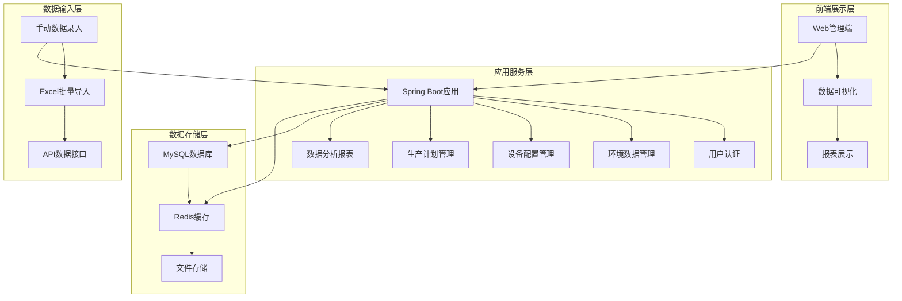
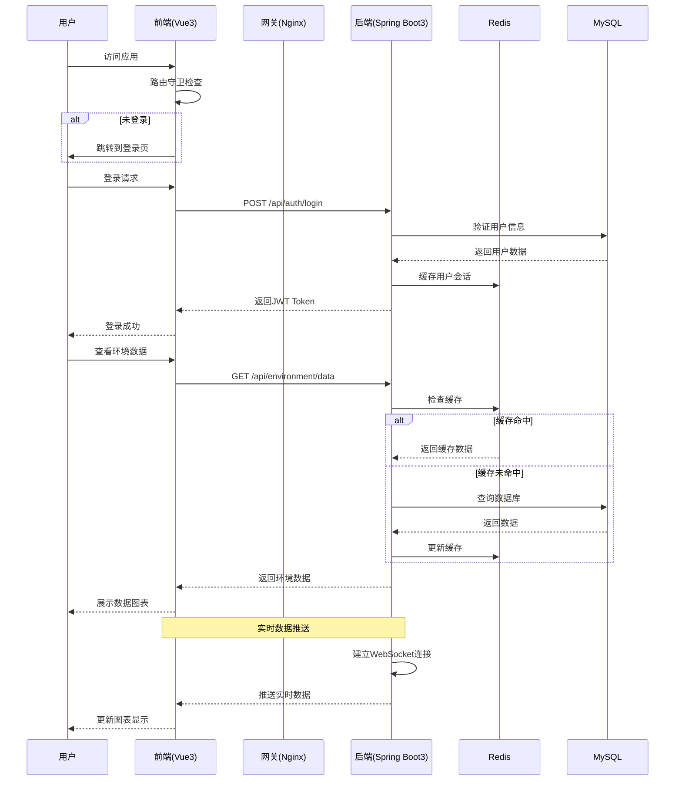

# 植物工厂管理系统

## 📋 目录

- [系统概述](#1-系统概述)
- [技术架构](#2-技术架构)
- [核心功能模块](#3-核心功能模块)
- [数据库设计](#4-数据库设计)
- [API接口文档](#5-api接口文档)
- [系统部署](#6-系统部署)
- [安全方案](#7-安全方案)
- [监控运维](#8-监控运维)
- [开发规范](#9-开发规范)
- [项目计划](#10-项目计划)

---

## 1. 系统概述

### 1.1 项目背景
植物工厂是一种通过高精度环境控制，在设施内实现植物全年连续生产的现代农业系统。本管理系统通过物联网、大数据、人工智能等技术，实现对植物工厂全流程的智能化管理和优化。

### 1.2 系统目标
- 🌱 **环境智能控制**：实时监测和自动调节生长环境参数
- 💧 **精准水肥管理**：基于植物需求的精准灌溉和施肥
- 📊 **数据驱动决策**：全方位数据采集分析和可视化展示
- 🚨 **智能预警系统**：异常情况实时报警和处理建议
- 📈 **生产效率优化**：通过算法模型优化资源配置和生产计划

### 1.3 系统架构


---

## 2. 技术架构

### 2.1 技术栈选型

#### 前端技术栈 (Vue 3 + TypeScript)
```json
// package.json
{
  "name": "plant-factory-frontend",
  "version": "1.0.0",
  "type": "module",
  "dependencies": {
    "vue": "^3.3.4",
    "vue-router": "^4.2.4",
    "pinia": "^2.1.6",
    "ant-design-vue": "^4.0.0",
    "@ant-design/icons-vue": "^7.0.0",
    "axios": "^1.5.0",
    "echarts": "^5.4.3",
    "vue-echarts": "^6.6.1",
    "dayjs": "^1.11.9",
    "@vueuse/core": "^10.4.1",
    "xlsx": "^0.18.5",
    "typescript": "^5.2.0"
  },
  "devDependencies": {
    "@vitejs/plugin-vue": "^4.3.4",
    "vite": "^4.4.9",
    "vue-tsc": "^1.8.8",
    "@vue/tsconfig": "^0.4.0",
    "vitest": "^0.34.4",
    "@playwright/test": "^1.37.1"
  }
}
```

#### 后端技术栈 (Spring Boot 3)
```xml
<!-- pom.xml 核心依赖 -->
<properties>
    <java.version>17</java.version>
    <spring-boot.version>3.1.5</spring-boot.version>
</properties>

<dependencies>
    <!-- Spring Boot Starters -->
    <dependency>
        <groupId>org.springframework.boot</groupId>
        <artifactId>spring-boot-starter-web</artifactId>
    </dependency>
    <dependency>
        <groupId>org.springframework.boot</groupId>
        <artifactId>spring-boot-starter-data-jpa</artifactId>
    </dependency>
    <dependency>
        <groupId>org.springframework.boot</groupId>
        <artifactId>spring-boot-starter-data-redis</artifactId>
    </dependency>
    <dependency>
        <groupId>org.springframework.boot</groupId>
        <artifactId>spring-boot-starter-security</artifactId>
    </dependency>
    <dependency>
        <groupId>org.springframework.boot</groupId>
        <artifactId>spring-boot-starter-websocket</artifactId>
    </dependency>
    <dependency>
        <groupId>org.springframework.boot</groupId>
        <artifactId>spring-boot-starter-validation</artifactId>
    </dependency>
    <dependency>
        <groupId>org.springframework.boot</groupId>
        <artifactId>spring-boot-starter-actuator</artifactId>
    </dependency>

    <!-- Database -->
    <dependency>
        <groupId>mysql</groupId>
        <artifactId>mysql-connector-java</artifactId>
        <version>8.0.33</version>
    </dependency>
    <dependency>
        <groupId>org.flywaydb</groupId>
        <artifactId>flyway-core</artifactId>
        <version>9.22.0</version>
    </dependency>

    <!-- JWT & Security -->
    <dependency>
        <groupId>io.jsonwebtoken</groupId>
        <artifactId>jjwt-api</artifactId>
        <version>0.11.5</version>
    </dependency>
    <dependency>
        <groupId>io.jsonwebtoken</groupId>
        <artifactId>jjwt-impl</artifactId>
        <version>0.11.5</version>
    </dependency>
    <dependency>
        <groupId>io.jsonwebtoken</groupId>
        <artifactId>jjwt-jackson</artifactId>
        <version>0.11.5</version>
    </dependency>

    <!-- Excel Processing -->
    <dependency>
        <groupId>org.apache.poi</groupId>
        <artifactId>poi</artifactId>
        <version>5.2.3</version>
    </dependency>
    <dependency>
        <groupId>org.apache.poi</groupId>
        <artifactId>poi-ooxml</artifactId>
        <version>5.2.3</version>
    </dependency>

    <!-- API Documentation -->
    <dependency>
        <groupId>org.springdoc</groupId>
        <artifactId>springdoc-openapi-starter-webmvc-ui</artifactId>
        <version>2.2.0</version>
    </dependency>

    <!-- Monitoring & Metrics -->
    <dependency>
        <groupId>io.micrometer</groupId>
        <artifactId>micrometer-registry-prometheus</artifactId>
    </dependency>

    <!-- Caching -->
    <dependency>
        <groupId>com.github.ben-manes.caffeine</groupId>
        <artifactId>caffeine</artifactId>
    </dependency>

    <!-- Rate Limiting -->
    <dependency>
        <groupId>com.github.vladimir-bukhtoyarov</groupId>
        <artifactId>bucket4j-spring-boot-starter</artifactId>
        <version>0.9.0</version>
    </dependency>

    <!-- Testing -->
    <dependency>
        <groupId>org.springframework.boot</groupId>
        <artifactId>spring-boot-starter-test</artifactId>
        <scope>test</scope>
    </dependency>
    <dependency>
        <groupId>org.testcontainers</groupId>
        <artifactId>junit-jupiter</artifactId>
        <scope>test</scope>
    </dependency>
    <dependency>
        <groupId>org.testcontainers</groupId>
        <artifactId>mysql</artifactId>
        <scope>test</scope>
    </dependency>
</dependencies>
```

### 2.2 项目架构设计

#### 2.2.1 后端项目结构 (Spring Boot 3)
```
plant-factory-backend/
├── pom.xml                          # Maven项目配置
├── README.md                        # 项目说明文档
├── docker-compose.yml              # Docker编排文件
├── Dockerfile                       # 容器化配置
├── src/main/java/com/plantfactory/
│   ├── PlantFactoryApplication.java # Spring Boot启动类
│   ├── config/                      # 配置类
│   │   ├── SecurityConfig.java      # Spring Security配置
│   │   ├── DatabaseConfig.java      # 数据库配置
│   │   ├── CacheConfig.java         # Redis缓存配置
│   │   ├── WebSocketConfig.java     # WebSocket实时推送配置
│   │   └── SwaggerConfig.java       # API文档配置
│   ├── controller/                  # 控制器层
│   │   ├── AuthController.java      # 认证相关接口
│   │   ├── EnvironmentController.java # 环境数据接口
│   │   ├── DeviceController.java    # 设备管理接口
│   │   └── ProductionController.java # 生产管理接口
│   ├── service/                     # 业务服务层
│   │   ├── AuthService.java         # 认证服务
│   │   ├── EnvironmentService.java  # 环境数据服务
│   │   ├── DeviceService.java       # 设备管理服务
│   │   ├── ProductionService.java   # 生产管理服务
│   │   └── ExcelImportService.java  # Excel导入服务
│   ├── repository/                  # 数据访问层
│   │   ├── UserRepository.java      # 用户数据访问
│   │   ├── EnvironmentDataRepository.java # 环境数据访问
│   │   ├── DeviceConfigRepository.java # 设备配置访问
│   │   └── ProductionPlanRepository.java # 生产计划访问
│   ├── entity/                      # 实体类
│   │   ├── User.java                # 用户实体
│   │   ├── EnvironmentData.java     # 环境数据实体
│   │   ├── DeviceConfig.java        # 设备配置实体
│   │   └── ProductionPlan.java      # 生产计划实体
│   ├── dto/                         # 数据传输对象
│   │   ├── AuthRequest.java         # 认证请求DTO
│   │   ├── EnvironmentDataDTO.java  # 环境数据DTO
│   │   └── DeviceConfigDTO.java     # 设备配置DTO
│   ├── security/                    # 安全相关
│   │   ├── JwtAuthenticationFilter.java # JWT认证过滤器
│   │   ├── UserDetailsServiceImpl.java # 用户详情服务
│   │   └── CustomUserDetails.java   # 自定义用户详情
│   ├── exception/                   # 异常处理
│   │   ├── GlobalExceptionHandler.java # 全局异常处理器
│   │   ├── BusinessException.java # 业务异常
│   │   └── ValidationException.java # 验证异常
│   └── util/                        # 工具类
│       ├── JwtUtil.java             # JWT工具类
│       ├── ExcelUtil.java           # Excel工具类
│       └── DateUtil.java            # 日期工具类
├── src/main/resources/
│   ├── application.yml              # 主配置文件
│   ├── application-dev.yml          # 开发环境配置
│   ├── application-prod.yml         # 生产环境配置
│   ├── db/migration/                # Flyway数据库迁移脚本
│   │   ├── V1__Create_user_tables.sql
│   │   ├── V2__Create_device_tables.sql
│   │   └── V3__Create_production_tables.sql
│   └── static/                      # 静态资源
└── src/test/java/                   # 测试代码
    ├── unit/                        # 单元测试
    ├── integration/                 # 集成测试
    └── e2e/                         # 端到端测试
```

#### 2.2.2 前端项目结构 (Vue 3 + TypeScript)
```
plant-factory-frontend/
├── package.json                     # 依赖和脚本配置
├── vite.config.ts                  # Vite构建配置
├── tsconfig.json                   # TypeScript配置
├── index.html                      # 入口HTML
├── public/                         # 静态资源
│   ├── favicon.ico
│   └── logo.png
├── src/
│   ├── main.ts                     # 应用入口
│   ├── App.vue                     # 根组件
│   ├── api/                        # API接口封装
│   │   ├── index.ts                # API基础配置
│   │   ├── auth.ts                 # 认证相关API
│   │   ├── environment.ts          # 环境数据API
│   │   ├── device.ts               # 设备管理API
│   │   └── production.ts           # 生产管理API
│   ├── components/                 # 通用组件
│   │   ├── charts/                 # 图表组件
│   │   │   ├── RealTimeChart.vue   # 实时数据图表
│   │   │   └── HistoryChart.vue    # 历史数据图表
│   │   ├── forms/                  # 表单组件
│   │   │   ├── EnvironmentForm.vue # 环境数据表单
│   │   │   └── DeviceForm.vue      # 设备配置表单
│   │   ├── layout/                 # 布局组件
│   │   │   ├── AppHeader.vue       # 页面头部
│   │   │   ├── AppSidebar.vue      # 侧边栏导航
│   │   │   └── AppLayout.vue       # 整体布局
│   │   └── common/                 # 通用组件
│   │       ├── LoadingSpinner.vue  # 加载动画
│   │       └── ErrorBoundary.vue   # 错误边界
│   ├── views/                      # 页面组件
│   │   ├── Dashboard.vue           # 仪表盘
│   │   ├── Login.vue               # 登录页
│   │   ├── environment/            # 环境监控模块
│   │   │   ├── EnvironmentMonitor.vue # 环境监控
│   │   │   └── EnvironmentData.vue  # 环境数据管理
│   │   ├── device/                 # 设备管理模块
│   │   │   ├── DeviceList.vue      # 设备列表
│   │   │   └── DeviceConfig.vue    # 设备配置
│   │   └── production/             # 生产管理模块
│   │       ├── ProductionPlan.vue  # 生产计划
│   │       └── ProductionBatch.vue # 生产批次
│   ├── stores/                     # Pinia状态管理
│   │   ├── index.ts                # Store入口
│   │   ├── auth.ts                 # 认证状态
│   │   ├── environment.ts          # 环境数据状态
│   │   └── device.ts               # 设备状态
│   ├── router/                     # 路由配置
│   │   └── index.ts                # 路由定义
│   ├── utils/                      # 工具函数
│   │   ├── request.ts              # HTTP请求封装
│   │   ├── auth.ts                 # 认证工具
│   │   ├── format.ts               # 格式化工具
│   │   └── validation.ts           # 表单验证工具
│   ├── types/                      # TypeScript类型定义
│   │   ├── index.ts                # 类型入口
│   │   ├── api.ts                  # API类型
│   │   ├── auth.ts                 # 认证类型
│   │   └── common.ts               # 通用类型
│   ├── styles/                     # 样式文件
│   │   ├── index.css               # 全局样式
│   │   ├── variables.css           # CSS变量
│   │   └── components.css          # 组件样式
│   └── assets/                     # 静态资源
│       ├── images/                 # 图片资源
│       └── icons/                  # 图标资源
└── tests/                          # 测试文件
    ├── unit/                       # 单元测试
    ├── e2e/                        # 端到端测试
    └── setup.ts                    # 测试配置
```

#### 2.2.3 模块化设计
- **用户认证模块**：JWT令牌认证、角色权限控制、密码加密
- **环境数据管理模块**：实时数据采集、历史数据查询、Excel批量导入
- **设备配置模块**：设备状态管理、参数配置、远程控制
- **生产计划模块**：种植计划制定、批次管理、生长记录
- **数据分析模块**：数据统计、报表生成、可视化展示
- **实时推送模块**：WebSocket实时数据推送、告警通知
- **系统监控模块**：性能监控、健康检查、日志管理

#### 2.2.4 前后端交互流程



#### 2.2.5 Spring Boot 3核心配置示例

**application.yml**
```yaml
server:
  port: 8080
  servlet:
    context-path: /api
  compression:
    enabled: true
    mime-types: application/json,application/xml,text/html

spring:
  application:
    name: plant-factory-management
  profiles:
    active: dev

  # 数据源配置
  datasource:
    url: jdbc:mysql://${DB_HOST:localhost}:${DB_PORT:3306}/${DB_NAME:plant_factory}?useUnicode=true&characterEncoding=utf8&useSSL=false&serverTimezone=Asia/Shanghai
    username: ${DB_USERNAME:root}
    password: ${DB_PASSWORD:root123}
    driver-class-name: com.mysql.cj.jdbc.Driver
    hikari:
      maximum-pool-size: 20
      minimum-idle: 5
      connection-timeout: 30000
      idle-timeout: 600000
      max-lifetime: 1800000

  # JPA配置
  jpa:
    hibernate:
      ddl-auto: validate
    show-sql: false
    properties:
      hibernate:
        dialect: org.hibernate.dialect.MySQL8Dialect
        format_sql: true
        use_sql_comments: true

  # Redis配置
  data:
    redis:
      host: ${REDIS_HOST:localhost}
      port: ${REDIS_PORT:6379}
      password: ${REDIS_PASSWORD:}
      database: 0
      timeout: 3000ms
      lettuce:
        pool:
          max-active: 8
          max-idle: 8
          min-idle: 0
          max-wait: -1ms

# JWT配置
jwt:
  secret: ${JWT_SECRET:plant-factory-jwt-secret-key-2024}
  expiration: 86400000  # 24小时

# 监控配置
management:
  endpoints:
    web:
      exposure:
        include: health,info,metrics,prometheus
  endpoint:
    health:
      show-details: always
  metrics:
    export:
      prometheus:
        enabled: true
```

**Vue 3 + TypeScript 配置示例**

**vite.config.ts**
```typescript
import { defineConfig } from 'vite'
import vue from '@vitejs/plugin-vue'
import { resolve } from 'path'

export default defineConfig({
  plugins: [vue()],
  resolve: {
    alias: {
      '@': resolve(__dirname, 'src'),
      '@components': resolve(__dirname, 'src/components'),
      '@views': resolve(__dirname, 'src/views'),
      '@api': resolve(__dirname, 'src/api'),
      '@utils': resolve(__dirname, 'src/utils'),
      '@stores': resolve(__dirname, 'src/stores'),
      '@types': resolve(__dirname, 'src/types')
    }
  },
  server: {
    port: 3000,
    proxy: {
      '/api': {
        target: 'http://localhost:8080',
        changeOrigin: true,
        rewrite: (path) => path.replace(/^\/api/, '')
      },
      '/ws': {
        target: 'ws://localhost:8080',
        ws: true
      }
    }
  },
  build: {
    outDir: 'dist',
    assetsDir: 'assets',
    sourcemap: false,
    rollupOptions: {
      output: {
        chunkFileNames: 'js/[name]-[hash].js',
        entryFileNames: 'js/[name]-[hash].js',
        assetFileNames: '[ext]/[name]-[hash].[ext]',
        manualChunks: {
          'vue-vendor': ['vue', 'vue-router', 'pinia'],
          'antd-vendor': ['ant-design-vue', '@ant-design/icons-vue'],
          'chart-vendor': ['echarts', 'vue-echarts']
        }
      }
    }
  }
})
```

---

## 3. 核心功能模块

### 3.1 环境数据管理模块

#### 3.1.1 数据参数管理
| 参数类型 | 数据范围 | 单位 | 录入方式 |
|---------|---------|------|---------|
| 温度 | 15-35 | °C | 手动录入/Excel导入 |
| 湿度 | 40-80 | %RH | 手动录入/Excel导入 |
| 光照强度 | 0-10000 | lux | 手动录入/Excel导入 |
| CO₂浓度 | 400-1500 | ppm | 手动录入/Excel导入 |
| pH值 | 5.5-7.0 | - | 手动录入/Excel导入 |

#### 3.1.2 环境数据服务
```java
@Service
@Slf4j
public class EnvironmentDataService {

    @Autowired
    private EnvironmentDataRepository environmentDataRepository;

    @Autowired
    private RedisTemplate<String, Object> redisTemplate;

    /**
     * 保存环境数据
     */
    public EnvironmentData saveEnvironmentData(EnvironmentDataDTO dto) {
        EnvironmentData data = EnvironmentData.builder()
            .areaId(dto.getAreaId())
            .dataTime(dto.getDataTime())
            .temperature(dto.getTemperature())
            .humidity(dto.getHumidity())
            .lightIntensity(dto.getLightIntensity())
            .co2Level(dto.getCo2Level())
            .phValue(dto.getPhValue())
            .operatorId(dto.getOperatorId())
            .createdAt(LocalDateTime.now())
            .build();

        EnvironmentData savedData = environmentDataRepository.save(data);

        // 更新最新数据到Redis缓存
        String cacheKey = String.format("env:latest:area:%d", dto.getAreaId());
        redisTemplate.opsForValue().set(cacheKey, savedData, Duration.ofHours(1));

        log.info("环境数据保存成功: areaId={}, time={}", dto.getAreaId(), dto.getDataTime());
        return savedData;
    }

    /**
     * 批量导入环境数据
     */
    @Transactional
    public List<EnvironmentData> batchImportData(List<EnvironmentDataDTO> dataList) {
        List<EnvironmentData> savedList = new ArrayList<>();

        for (EnvironmentDataDTO dto : dataList) {
            try {
                EnvironmentData data = convertToEntity(dto);
                savedList.add(environmentDataRepository.save(data));
            } catch (Exception e) {
                log.error("数据导入失败: {}", dto, e);
            }
        }

        return savedList;
    }

    /**
     * 获取历史环境数据
     */
    public Page<EnvironmentData> getHistoryData(Long areaId, LocalDateTime startTime,
                                               LocalDateTime endTime, Pageable pageable) {
        return environmentDataRepository.findByAreaIdAndDataTimeBetween(
            areaId, startTime, endTime, pageable);
    }
}
```

#### 3.1.3 Vue 3前端组件实现

**环境数据监控组件 (Vue 3 + TypeScript)**
```vue
<template>
  <div class="environment-monitor">
    <!-- 实时数据卡片 -->
    <a-row :gutter="[16, 16]" class="mb-4">
      <a-col :span="6" v-for="metric in metrics" :key="metric.key">
        <a-card>
          <a-statistic
            :title="metric.title"
            :value="metric.value"
            :suffix="metric.unit"
            :value-style="{ color: metric.color }"
            :precision="metric.precision || 1"
          >
            <template #prefix>
              <component :is="metric.icon" />
            </template>
          </a-statistic>
        </a-card>
      </a-col>
    </a-row>

    <!-- 实时图表 -->
    <a-row :gutter="[16, 16]">
      <a-col :span="12">
        <a-card title="温度趋势" :loading="loading">
          <v-chart
            :option="temperatureChartOption"
            style="height: 300px;"
            autoresize
          />
        </a-card>
      </a-col>
      <a-col :span="12">
        <a-card title="湿度趋势" :loading="loading">
          <v-chart
            :option="humidityChartOption"
            style="height: 300px;"
            autoresize
          />
        </a-card>
      </a-col>
    </a-row>

    <!-- 数据导入 -->
    <a-card title="数据导入" class="mt-4">
      <a-space direction="vertical" style="width: 100%">
        <a-row :gutter="16">
          <a-col :span="18">
            <a-range-picker
              v-model:value="dateRange"
              @change="handleDateChange"
              style="width: 100%"
            />
          </a-col>
          <a-col :span="6">
            <a-button type="primary" @click="loadEnvironmentData" :loading="loading">
              查询数据
            </a-button>
          </a-col>
        </a-row>

        <a-upload
          :file-list="fileList"
          :before-upload="beforeUpload"
          @change="handleFileChange"
          accept=".xlsx,.xls"
          :multiple="false"
        >
          <a-button icon="upload" :loading="importing">
            导入Excel数据
          </a-button>
        </a-upload>
      </a-space>
    </a-card>

    <!-- 数据表格 -->
    <a-card title="环境数据记录" class="mt-4">
      <a-table
        :columns="columns"
        :data-source="dataList"
        :loading="loading"
        :pagination="pagination"
        row-key="id"
        @change="handleTableChange"
        :scroll="{ x: 1200 }"
      />
    </a-card>
  </div>
</template>

<script setup lang="ts">
import { ref, onMounted, onUnmounted, computed, watch } from 'vue'
import { use } from 'echarts/core'
import { CanvasRenderer } from 'echarts/renderers'
import { LineChart } from 'echarts/charts'
import {
  TitleComponent,
  TooltipComponent,
  LegendComponent,
  GridComponent,
  DataZoomComponent
} from 'echarts/components'
import VChart from 'vue-echarts'
import { message } from 'ant-design-vue'
import {
  ThermometerOutlined,
  EyeOutlined,
  BulbOutlined,
  CloudOutlined
} from '@ant-design/icons-vue'
import { environmentApi } from '@/api/environment'
import type {
  EnvironmentData,
  EnvironmentDataQuery,
  UploadFile
} from '@/types/environment'
import dayjs from 'dayjs'

// 注册ECharts组件
use([
  CanvasRenderer,
  LineChart,
  TitleComponent,
  TooltipComponent,
  LegendComponent,
  GridComponent,
  DataZoomComponent
])

// 响应式数据
const loading = ref(false)
const importing = ref(false)
const fileList = ref<UploadFile[]>([])
const dataList = ref<EnvironmentData[]>([])
const dateRange = ref<[dayjs.Dayjs, dayjs.Dayjs]>()
const selectedArea = ref<number>(1)
const current = ref<number>(1)
const pageSize = ref<number>(20)
const total = ref<number>(0)

// WebSocket连接
let ws: WebSocket | null = null

// 计算属性
const metrics = computed(() => {
  if (dataList.value.length === 0) {
    return [
      { key: 'temperature', title: '温度', value: 0, unit: '°C', color: '#1890ff', icon: 'ThermometerOutlined' },
      { key: 'humidity', title: '湿度', value: 0, unit: '%', color: '#52c41a', icon: 'EyeOutlined' },
      { key: 'lightIntensity', title: '光照强度', value: 0, unit: 'lux', color: '#faad14', icon: 'BulbOutlined' },
      { key: 'co2Level', title: 'CO₂浓度', value: 0, unit: 'ppm', color: '#f5222d', icon: 'CloudOutlined' }
    ]
  }

  const latest = dataList.value[dataList.value.length - 1]
  return [
    {
      key: 'temperature',
      title: '当前温度',
      value: latest?.temperature || 0,
      unit: '°C',
      color: '#1890ff',
      icon: 'ThermometerOutlined',
      precision: 1
    },
    {
      key: 'humidity',
      title: '当前湿度',
      value: latest?.humidity || 0,
      unit: '%',
      color: '#52c41a',
      icon: 'EyeOutlined',
      precision: 1
    },
    {
      key: 'lightIntensity',
      title: '光照强度',
      value: latest?.lightIntensity || 0,
      unit: 'lux',
      color: '#faad14',
      icon: 'BulbOutlined',
      precision: 0
    },
    {
      key: 'co2Level',
      title: 'CO₂浓度',
      value: latest?.co2Level || 0,
      unit: 'ppm',
      color: '#f5222d',
      icon: 'CloudOutlined',
      precision: 0
    }
  ]
})

const temperatureChartOption = computed(() => ({
  tooltip: {
    trigger: 'axis',
    formatter: (params: any) => {
      const param = params[0]
      return `${param.name}<br/>温度: ${param.value}°C`
    }
  },
  title: {
    text: '实时温度监控',
    left: 'center'
  },
  xAxis: {
    type: 'category',
    data: realTimeData.value.map(item =>
      dayjs(item.dataTime).format('HH:mm:ss')
    )
  },
  yAxis: {
    type: 'value',
    name: '温度 (°C)',
    min: 15,
    max: 35
  },
  series: [{
    data: realTimeData.value.map(item => item.temperature),
    type: 'line',
    smooth: true,
    name: '温度',
    lineStyle: {
      color: '#1890ff',
      width: 2
    },
    areaStyle: {
      color: {
        type: 'linear',
        x: 0, y: 0, x2: 0, y2: 1,
        colorStops: [
          { offset: 0, color: 'rgba(24, 144, 255, 0.3)' },
          { offset: 1, color: 'rgba(24, 144, 255, 0.1)' }
        ]
      }
    }
  }],
  dataZoom: [{
    type: 'inside',
    start: 0,
    end: 100
  }]
}))

const humidityChartOption = computed(() => ({
  tooltip: {
    trigger: 'axis',
    formatter: (params: any) => {
      const param = params[0]
      return `${param.name}<br/>湿度: ${param.value}%`
    }
  },
  title: {
    text: '实时湿度监控',
    left: 'center'
  },
  xAxis: {
    type: 'category',
    data: realTimeData.value.map(item =>
      dayjs(item.dataTime).format('HH:mm:ss')
    )
  },
  yAxis: {
    type: 'value',
    name: '湿度 (%)',
    min: 40,
    max: 80
  },
  series: [{
    data: realTimeData.value.map(item => item.humidity),
    type: 'line',
    smooth: true,
    name: '湿度',
    lineStyle: {
      color: '#52c41a',
      width: 2
    },
    areaStyle: {
      color: {
        type: 'linear',
        x: 0, y: 0, x2: 0, y2: 1,
        colorStops: [
          { offset: 0, color: 'rgba(82, 196, 26, 0.3)' },
          { offset: 1, color: 'rgba(82, 196, 26, 0.1)' }
        ]
      }
    }
  }],
  dataZoom: [{
    type: 'inside',
    start: 0,
    end: 100
  }]
}))

// 实时数据（用于图表显示）
const realTimeData = computed(() => {
  // 获取最近100条实时数据
  return dataList.value.slice(-100)
})

// 分页配置
const pagination = computed(() => ({
  current: current.value,
  pageSize: pageSize.value,
  total: total.value,
  showSizeChanger: true,
  showQuickJumper: true,
  showTotal: (total: number) => `共 ${total} 条数据`,
  pageSizeOptions: ['10', '20', '50', '100']
}))

// 表格列配置
const columns = [
  {
    title: '记录时间',
    dataIndex: 'dataTime',
    key: 'dataTime',
    width: 180,
    fixed: 'left',
    sorter: true,
    customRender: ({ text }: { text: string }) =>
      dayjs(text).format('YYYY-MM-DD HH:mm:ss')
  },
  {
    title: '温度(°C)',
    dataIndex: 'temperature',
    key: 'temperature',
    width: 100,
    sorter: true,
    customRender: ({ text }: { text: number }) => text?.toFixed(1) || '-'
  },
  {
    title: '湿度(%)',
    dataIndex: 'humidity',
    key: 'humidity',
    width: 100,
    sorter: true,
    customRender: ({ text }: { text: number }) => text?.toFixed(1) || '-'
  },
  {
    title: '光照(lux)',
    dataIndex: 'lightIntensity',
    key: 'lightIntensity',
    width: 120,
    sorter: true,
    customRender: ({ text }: { text: number }) => text?.toFixed(0) || '-'
  },
  {
    title: 'CO₂(ppm)',
    dataIndex: 'co2Level',
    key: 'co2Level',
    width: 100,
    sorter: true,
    customRender: ({ text }: { text: number }) => text?.toFixed(0) || '-'
  },
  {
    title: 'pH值',
    dataIndex: 'phValue',
    key: 'phValue',
    width: 100,
    customRender: ({ text }: { text: number }) => text?.toFixed(2) || '-'
  },
  {
    title: 'EC值(mS/cm)',
    dataIndex: 'ecValue',
    key: 'ecValue',
    width: 120,
    customRender: ({ text }: { text: number }) => text?.toFixed(2) || '-'
  },
  {
    title: '数据来源',
    dataIndex: 'dataSource',
    key: 'dataSource',
    width: 100,
    filters: [
      { text: '手动录入', value: 'MANUAL' },
      { text: 'Excel导入', value: 'EXCEL_IMPORT' },
      { text: 'API接口', value: 'API' }
    ]
  },
  {
    title: '质量标识',
    dataIndex: 'qualityFlag',
    key: 'qualityFlag',
    width: 100,
    filters: [
      { text: '良好', value: 'GOOD' },
      { text: '警告', value: 'WARNING' },
      { text: '错误', value: 'ERROR' }
    ]
  }
]

// 方法
const initWebSocket = () => {
  const wsUrl = `ws://localhost:8080/api/ws/environment?areaId=${selectedArea.value}`
  ws = new WebSocket(wsUrl)

  ws.onmessage = (event) => {
    try {
      const data = JSON.parse(event.data)
      dataList.value.push(data)

      // 保持最近1000条数据用于图表显示
      if (dataList.value.length > 1000) {
        dataList.value.shift()
      }
    } catch (error) {
      console.error('WebSocket数据解析失败:', error)
    }
  }

  ws.onerror = (error) => {
    console.error('WebSocket连接错误:', error)
    message.error('实时数据连接失败')
  }

  ws.onclose = () => {
    console.log('WebSocket连接关闭')
    // 5秒后重连
    setTimeout(initWebSocket, 5000)
  }
}

const loadEnvironmentData = async () => {
  loading.value = true
  try {
    const query: EnvironmentDataQuery = {
      areaId: selectedArea.value,
      page: current.value,
      size: pageSize.value
    }

    if (dateRange.value) {
      query.startTime = dateRange.value[0].toDate()
      query.endTime = dateRange.value[1].toDate()
    }

    const response = await environmentApi.getHistoryData(query)
    dataList.value = response.data.records
    total.value = response.data.total
  } catch (error) {
    console.error('加载环境数据失败:', error)
    message.error('加载数据失败')
  } finally {
    loading.value = false
  }
}

const beforeUpload = (file: File) => {
  const isExcel = file.type === 'application/vnd.openxmlformats-officedocument.spreadsheetml.sheet' ||
                  file.type === 'application/vnd.ms-excel'
  if (!isExcel) {
    message.error('只能上传Excel文件!')
    return false
  }

  if (file.size > 10 * 1024 * 1024) {
    message.error('文件大小不能超过10MB!')
    return false
  }

  return false // 阻止自动上传
}

const handleFileChange = (info: any) => {
  fileList.value = info.fileList.slice(-1) // 只保留最后一个文件
}

const handleImport = async () => {
  if (fileList.value.length === 0) {
    message.warning('请先选择要导入的文件')
    return
  }

  importing.value = true
  try {
    const file = fileList.value[0]
    const formData = new FormData()
    formData.append('file', file.originFileObj as File)
    formData.append('areaId', selectedArea.value.toString())

    const response = await environmentApi.batchImport(formData)
    message.success(`成功导入 ${response.data.successCount} 条数据`)
    fileList.value = []
    loadEnvironmentData()
  } catch (error) {
    console.error('数据导入失败:', error)
    message.error('数据导入失败')
  } finally {
    importing.value = false
  }
}

const handleDateChange = () => {
  current.value = 1 // 重置页码
  loadEnvironmentData()
}

const handleTableChange = (pagination: any, filters: any, sorter: any) => {
  current.value = pagination.current
  pageSize.value = pagination.pageSize
  loadEnvironmentData()
}

// 生命周期
onMounted(() => {
  loadEnvironmentData()
  initWebSocket()
})

onUnmounted(() => {
  if (ws) {
    ws.close()
    ws = null
  }
})

// 监听区域变化
watch(selectedArea, () => {
  loadEnvironmentData()
  // 重新连接WebSocket
  if (ws) {
    ws.close()
    ws = null
  }
  initWebSocket()
})
</script>

<style scoped>
.environment-monitor {
  padding: 16px;
}

.mb-4 {
  margin-bottom: 16px;
}

.mt-4 {
  margin-top: 16px;
}
</style>
```

### 3.2 设备配置管理模块

#### 3.2.1 设备信息管理
| 设备类型 | 管理字段 | 配置项 | 状态 |
|---------|---------|-------|------|
| 环境监控设备 | 设备名称、型号、位置 | 温度/湿度/光照范围 | 正常/维护/离线 |
| 控制设备 | 设备名称、类型、参数 | 温控/灌溉参数 | 正常/维护/离线 |
| 传感器 | 设备名称、精度、校准 | 监测参数、阈值 | 正常/维护/离线 |

#### 3.2.2 设备配置服务
```java
@Service
@Slf4j
public class DeviceConfigService {

    @Autowired
    private DeviceConfigRepository deviceConfigRepository;

    /**
     * 创建设备配置
     */
    public DeviceConfig createDeviceConfig(DeviceConfigDTO dto) {
        DeviceConfig config = DeviceConfig.builder()
            .deviceCode(dto.getDeviceCode())
            .deviceName(dto.getDeviceName())
            .deviceType(dto.getDeviceType())
            .areaId(dto.getAreaId())
            .location(dto.getLocation())
            .parameters(dto.getParameters())
            .status(DeviceStatus.NORMAL)
            .createdAt(LocalDateTime.now())
            .build();

        return deviceConfigRepository.save(config);
    }

    /**
     * 更新设备参数配置
     */
    public DeviceConfig updateDeviceParameters(Long deviceId, Map<String, Object> parameters) {
        DeviceConfig config = deviceConfigRepository.findById(deviceId)
            .orElseThrow(() -> new RuntimeException("设备不存在"));

        config.setParameters(parameters);
        config.setUpdatedAt(LocalDateTime.now());

        return deviceConfigRepository.save(config);
    }

    /**
     * 获取区域内的设备列表
     */
    public List<DeviceConfig> getDevicesByArea(Long areaId) {
        return deviceConfigRepository.findByAreaIdAndStatus(areaId, DeviceStatus.NORMAL);
    }

    /**
     * 导出设备配置到Excel
     */
    public void exportDeviceConfigToExcel(HttpServletResponse response) throws IOException {
        List<DeviceConfig> devices = deviceConfigRepository.findAll();

        Workbook workbook = new XSSFWorkbook();
        Sheet sheet = workbook.createSheet("设备配置");

        // 创建表头
        Row headerRow = sheet.createRow(0);
        String[] headers = {"设备编码", "设备名称", "设备类型", "所在区域", "位置", "状态", "创建时间"};
        for (int i = 0; i < headers.length; i++) {
            headerRow.createCell(i).setCellValue(headers[i]);
        }

        // 填充数据
        for (int i = 0; i < devices.size(); i++) {
            Row row = sheet.createRow(i + 1);
            DeviceConfig device = devices.get(i);
            row.createCell(0).setCellValue(device.getDeviceCode());
            row.createCell(1).setCellValue(device.getDeviceName());
            row.createCell(2).setCellValue(device.getDeviceType().toString());
            row.createCell(3).setCellValue(device.getAreaId());
            row.createCell(4).setCellValue(device.getLocation());
            row.createCell(5).setCellValue(device.getStatus().toString());
            row.createCell(6).setCellValue(device.getCreatedAt().toString());
        }

        response.setContentType("application/vnd.openxmlformats-officedocument.spreadsheetml.sheet");
        response.setHeader("Content-Disposition", "attachment; filename=device_config.xlsx");
        workbook.write(response.getOutputStream());
        workbook.close();
    }
}
```

### 3.3 生产计划管理模块

#### 3.3.1 生产计划配置
| 植物类型 | 生长周期(天) | 种植密度(株/m²) | 预期产量(kg/m²) | 栽培方式 |
|---------|-------------|---------------|----------------|----------|
| 生菜 | 45 | 25 | 3.5 | 水培 |
| 菠菜 | 35 | 30 | 2.8 | 土培 |
| 西红柿 | 90 | 4 | 8.0 | 无土栽培 |
| 黄瓜 | 70 | 5 | 6.5 | 立体栽培 |

#### 3.3.2 生产计划服务
```java
@Service
@Slf4j
public class ProductionPlanService {

    @Autowired
    private ProductionPlanRepository productionPlanRepository;

    @Autowired
    private ProductionBatchRepository productionBatchRepository;

    /**
     * 创建生产计划
     */
    public ProductionPlan createProductionPlan(ProductionPlanDTO dto) {
        ProductionPlan plan = ProductionPlan.builder()
            .planName(dto.getPlanName())
            .plantType(dto.getPlantType())
            .areaId(dto.getAreaId())
            .totalArea(dto.getTotalArea())
            .plantingDensity(dto.getPlantingDensity())
            .expectedYield(dto.getExpectedYield())
            .plantingDate(dto.getPlantingDate())
            .expectedHarvestDate(dto.getExpectedHarvestDate())
            .planStatus(PlanStatus.CREATED)
            .creatorId(dto.getCreatorId())
            .createdAt(LocalDateTime.now())
            .build();

        return productionPlanRepository.save(plan);
    }

    /**
     * 生成生产批次
     */
    @Transactional
    public List<ProductionBatch> generateProductionBatches(Long planId) {
        ProductionPlan plan = productionPlanRepository.findById(planId)
            .orElseThrow(() -> new RuntimeException("生产计划不存在"));

        // 计算批次数量
        int batchCount = calculateBatchCount(plan);

        List<ProductionBatch> batches = new ArrayList<>();
        LocalDate currentDate = plan.getPlantingDate();

        for (int i = 0; i < batchCount; i++) {
            ProductionBatch batch = ProductionBatch.builder()
                .batchCode(generateBatchCode(plan.getPlantType(), i + 1))
                .planId(planId)
                .plantType(plan.getPlantType())
                .areaId(plan.getAreaId())
                .batchStatus(BatchStatus.PLANNED)
                .sowingDate(currentDate.plusDays(i * 7)) // 每周一个批次
                .expectedHarvestDate(currentDate.plusDays(i * 7 + plan.getGrowthCycle()))
                .expectedYield(plan.getExpectedYield() / batchCount)
                .createdAt(LocalDateTime.now())
                .build();

            batches.add(productionBatchRepository.save(batch));
        }

        // 更新计划状态
        plan.setPlanStatus(PlanStatus.IN_PROGRESS);
        productionPlanRepository.save(plan);

        return batches;
    }

    /**
     * 获取生产计划执行情况
     */
    public PlanExecutionStatus getPlanExecutionStatus(Long planId) {
        ProductionPlan plan = productionPlanRepository.findById(planId)
            .orElseThrow(() -> new RuntimeException("生产计划不存在"));

        List<ProductionBatch> batches = productionBatchRepository.findByPlanId(planId);

        long totalBatches = batches.size();
        long completedBatches = batches.stream()
            .filter(b -> b.getBatchStatus() == BatchStatus.COMPLETED)
            .count();
        long inProgressBatches = batches.stream()
            .filter(b -> b.getBatchStatus() == BatchStatus.GROWING)
            .count();

        return PlanExecutionStatus.builder()
            .planId(planId)
            .planName(plan.getPlanName())
            .totalBatches(totalBatches)
            .completedBatches(completedBatches)
            .inProgressBatches(inProgressBatches)
            .completionRate(totalBatches > 0 ? (double) completedBatches / totalBatches : 0.0)
            .totalYield(batches.stream()
                .filter(b -> b.getActualYield() != null)
                .mapToDouble(ProductionBatch::getActualYield)
                .sum())
            .build();
    }
}
```

---

## 4. 数据库设计

### 4.1 核心数据表

#### 4.1.1 用户管理相关表

##### 用户表 (users)
```sql
CREATE TABLE users (
    id BIGINT PRIMARY KEY AUTO_INCREMENT COMMENT '用户ID',
    username VARCHAR(50) NOT NULL UNIQUE COMMENT '用户名',
    password VARCHAR(100) NOT NULL COMMENT '密码(加密)',
    email VARCHAR(100) UNIQUE COMMENT '邮箱',
    phone VARCHAR(20) COMMENT '手机号',
    real_name VARCHAR(50) COMMENT '真实姓名',
    avatar_url VARCHAR(255) COMMENT '头像URL',
    status ENUM('ACTIVE', 'INACTIVE', 'LOCKED') DEFAULT 'ACTIVE' COMMENT '用户状态',
    last_login_time DATETIME COMMENT '最后登录时间',
    created_at DATETIME DEFAULT CURRENT_TIMESTAMP COMMENT '创建时间',
    updated_at DATETIME DEFAULT CURRENT_TIMESTAMP ON UPDATE CURRENT_TIMESTAMP COMMENT '更新时间',
    deleted_at DATETIME COMMENT '删除时间',

    INDEX idx_username (username),
    INDEX idx_email (email),
    INDEX idx_status (status)
) ENGINE=InnoDB DEFAULT CHARSET=utf8mb4 COLLATE=utf8mb4_unicode_ci COMMENT='用户表';
```

##### 角色表 (roles)
```sql
CREATE TABLE roles (
    id BIGINT PRIMARY KEY AUTO_INCREMENT COMMENT '角色ID',
    role_name VARCHAR(50) NOT NULL UNIQUE COMMENT '角色名称',
    role_code VARCHAR(50) NOT NULL UNIQUE COMMENT '角色编码',
    description TEXT COMMENT '角色描述',
    status ENUM('ACTIVE', 'INACTIVE') DEFAULT 'ACTIVE' COMMENT '状态',
    created_at DATETIME DEFAULT CURRENT_TIMESTAMP COMMENT '创建时间',
    updated_at DATETIME DEFAULT CURRENT_TIMESTAMP ON UPDATE CURRENT_TIMESTAMP COMMENT '更新时间',

    INDEX idx_role_code (role_code)
) ENGINE=InnoDB DEFAULT CHARSET=utf8mb4 COLLATE=utf8mb4_unicode_ci COMMENT='角色表';
```

##### 用户角色关联表 (user_roles)
```sql
CREATE TABLE user_roles (
    id BIGINT PRIMARY KEY AUTO_INCREMENT COMMENT '主键ID',
    user_id BIGINT NOT NULL COMMENT '用户ID',
    role_id BIGINT NOT NULL COMMENT '角色ID',
    created_at DATETIME DEFAULT CURRENT_TIMESTAMP COMMENT '创建时间',

    UNIQUE KEY uk_user_role (user_id, role_id),
    FOREIGN KEY (user_id) REFERENCES users(id) ON DELETE CASCADE,
    FOREIGN KEY (role_id) REFERENCES roles(id) ON DELETE CASCADE
) ENGINE=InnoDB DEFAULT CHARSET=utf8mb4 COLLATE=utf8mb4_unicode_ci COMMENT='用户角色关联表';
```

#### 4.1.2 基础数据管理表

##### 生产区域表 (production_areas)
```sql
CREATE TABLE production_areas (
    id BIGINT PRIMARY KEY AUTO_INCREMENT COMMENT '区域ID',
    area_code VARCHAR(50) NOT NULL UNIQUE COMMENT '区域编码',
    area_name VARCHAR(100) NOT NULL COMMENT '区域名称',
    area_type ENUM('SEEDING', 'GROWING', 'FLOWERING', 'HARVESTING') DEFAULT 'GROWING' COMMENT '区域类型',
    capacity DECIMAL(8,2) NOT NULL COMMENT '容量(平方米)',
    current_usage DECIMAL(8,2) DEFAULT 0 COMMENT '当前使用面积(平方米)',
    max_capacity_plants INT COMMENT '最大植物数量',
    current_plant_count INT DEFAULT 0 COMMENT '当前植物数量',
    location VARCHAR(200) COMMENT '位置描述',
    description TEXT COMMENT '区域描述',
    environmental_config JSON COMMENT '环境配置参数',
    status ENUM('ACTIVE', 'MAINTENANCE', 'INACTIVE') DEFAULT 'ACTIVE' COMMENT '状态',
    created_at DATETIME DEFAULT CURRENT_TIMESTAMP COMMENT '创建时间',
    updated_at DATETIME DEFAULT CURRENT_TIMESTAMP ON UPDATE CURRENT_TIMESTAMP COMMENT '更新时间',

    INDEX idx_area_code (area_code),
    INDEX idx_area_type (area_type),
    INDEX idx_status (status)
) ENGINE=InnoDB DEFAULT CHARSET=utf8mb4 COLLATE=utf8mb4_unicode_ci COMMENT='生产区域表';
```

##### 设备配置表 (device_configs)
```sql
CREATE TABLE device_configs (
    id BIGINT PRIMARY KEY AUTO_INCREMENT COMMENT '设备ID',
    device_code VARCHAR(50) NOT NULL UNIQUE COMMENT '设备编码',
    device_name VARCHAR(100) NOT NULL COMMENT '设备名称',
    device_type ENUM('MONITOR', 'CONTROL', 'SENSOR') NOT NULL COMMENT '设备类型',
    device_category VARCHAR(50) COMMENT '设备分类',
    area_id BIGINT COMMENT '所属区域ID',
    location VARCHAR(200) COMMENT '设备位置',
    manufacturer VARCHAR(100) COMMENT '制造商',
    model VARCHAR(100) COMMENT '型号',
    parameters JSON COMMENT '设备参数配置（温度范围、湿度阈值等）',
    data_source ENUM('MANUAL', 'EXCEL_IMPORT', 'API') DEFAULT 'MANUAL' COMMENT '数据来源',
    maintenance_interval INT COMMENT '维护间隔(天)',
    last_maintenance_date DATE COMMENT '上次维护日期',
    status ENUM('NORMAL', 'MAINTENANCE', 'OFFLINE') DEFAULT 'NORMAL' COMMENT '设备状态',
    operator_id BIGINT COMMENT '最后操作人ID',
    created_at DATETIME DEFAULT CURRENT_TIMESTAMP COMMENT '创建时间',
    updated_at DATETIME DEFAULT CURRENT_TIMESTAMP ON UPDATE CURRENT_TIMESTAMP COMMENT '更新时间',
    deleted_at DATETIME COMMENT '删除时间',

    FOREIGN KEY (area_id) REFERENCES production_areas(id) ON DELETE SET NULL,
    FOREIGN KEY (operator_id) REFERENCES users(id) ON DELETE SET NULL,
    INDEX idx_device_code (device_code),
    INDEX idx_device_type (device_type),
    INDEX idx_area_device (area_id, device_type),
    INDEX idx_status (status)
) ENGINE=InnoDB DEFAULT CHARSET=utf8mb4 COLLATE=utf8mb4_unicode_ci COMMENT='设备配置表';
```

##### 环境数据表 (environment_data)
```sql
CREATE TABLE environment_data (
    id BIGINT PRIMARY KEY AUTO_INCREMENT COMMENT '数据ID',
    area_id BIGINT NOT NULL COMMENT '区域ID',
    data_time DATETIME NOT NULL COMMENT '数据时间',
    temperature DECIMAL(5,2) COMMENT '温度(°C)',
    humidity DECIMAL(5,2) COMMENT '湿度(%)',
    light_intensity DECIMAL(10,2) COMMENT '光照强度(lux)',
    co2_level DECIMAL(8,2) COMMENT 'CO2浓度(ppm)',
    ph_value DECIMAL(4,2) COMMENT 'pH值',
    ec_value DECIMAL(5,2) COMMENT 'EC值(mS/cm)',
    soil_moisture DECIMAL(5,2) COMMENT '土壤湿度(%)',
    data_source ENUM('MANUAL', 'EXCEL_IMPORT', 'API') DEFAULT 'MANUAL' COMMENT '数据来源',
    operator_id BIGINT COMMENT '操作员ID',
    quality_flag ENUM('GOOD', 'WARNING', 'ERROR') DEFAULT 'GOOD' COMMENT '数据质量标识',
    remarks TEXT COMMENT '备注',
    created_at DATETIME DEFAULT CURRENT_TIMESTAMP COMMENT '创建时间',

    FOREIGN KEY (area_id) REFERENCES production_areas(id),
    FOREIGN KEY (operator_id) REFERENCES users(id),
    INDEX idx_area_time (area_id, data_time),
    INDEX idx_data_time (data_time),
    INDEX idx_quality_time (quality_flag, data_time)
) ENGINE=InnoDB DEFAULT CHARSET=utf8mb4 COLLATE=utf8mb4_unicode_ci COMMENT='环境数据表'
PARTITION BY RANGE (TO_DAYS(data_time)) (
    PARTITION p_current VALUES LESS THAN (TO_DAYS(NOW() + INTERVAL 1 DAY)),
    PARTITION p_history VALUES LESS THAN (MAXVALUE)
);
```

#### 4.1.3 生产管理相关表

##### 生产计划表 (production_plans)
```sql
CREATE TABLE production_plans (
    id BIGINT PRIMARY KEY AUTO_INCREMENT COMMENT '计划ID',
    plan_name VARCHAR(100) NOT NULL COMMENT '计划名称',
    plan_code VARCHAR(50) NOT NULL UNIQUE COMMENT '计划编码',
    plant_type VARCHAR(50) NOT NULL COMMENT '植物类型',
    variety VARCHAR(100) COMMENT '品种名称',
    area_id BIGINT COMMENT '区域ID',
    total_area DECIMAL(8,2) NOT NULL COMMENT '种植总面积(平方米)',
    planting_density DECIMAL(6,2) NOT NULL COMMENT '种植密度(株/平方米)',
    expected_yield DECIMAL(10,2) NOT NULL COMMENT '预期产量(kg)',
    growth_cycle INT NOT NULL COMMENT '生长周期(天)',
    planting_date DATE NOT NULL COMMENT '种植日期',
    expected_harvest_date DATE COMMENT '预计收获日期',
    actual_harvest_date DATE COMMENT '实际收获日期',
    plan_status ENUM('CREATED', 'IN_PROGRESS', 'COMPLETED', 'CANCELLED') DEFAULT 'CREATED' COMMENT '计划状态',
    creator_id BIGINT NOT NULL COMMENT '创建人ID',
    remarks TEXT COMMENT '备注',
    created_at DATETIME DEFAULT CURRENT_TIMESTAMP COMMENT '创建时间',
    updated_at DATETIME DEFAULT CURRENT_TIMESTAMP ON UPDATE CURRENT_TIMESTAMP COMMENT '更新时间',

    FOREIGN KEY (area_id) REFERENCES production_areas(id),
    FOREIGN KEY (creator_id) REFERENCES users(id),
    INDEX idx_plan_code (plan_code),
    INDEX idx_plant_type (plant_type),
    INDEX idx_plan_status (plan_status)
) ENGINE=InnoDB DEFAULT CHARSET=utf8mb4 COLLATE=utf8mb4_unicode_ci COMMENT='生产计划表';
```

##### 生产批次表 (production_batches)
```sql
CREATE TABLE production_batches (
    id BIGINT PRIMARY KEY AUTO_INCREMENT COMMENT '批次ID',
    batch_code VARCHAR(50) NOT NULL UNIQUE COMMENT '批次编码',
    plan_id BIGINT NOT NULL COMMENT '计划ID',
    plant_type VARCHAR(50) NOT NULL COMMENT '植物类型',
    variety VARCHAR(100) COMMENT '品种名称',
    area_id BIGINT NOT NULL COMMENT '区域ID',
    batch_status ENUM('PLANNED', 'SOWN', 'GROWING', 'READY_TO_HARVEST', 'HARVESTED', 'COMPLETED') DEFAULT 'PLANNED' COMMENT '批次状态',
    sowing_date DATE COMMENT '播种日期',
    expected_harvest_date DATE COMMENT '预计收获日期',
    actual_harvest_date DATE COMMENT '实际收获日期',
    planting_area DECIMAL(6,2) NOT NULL COMMENT '种植面积(平方米)',
    plant_count INT COMMENT '种植数量',
    expected_yield DECIMAL(8,2) COMMENT '预期产量(kg)',
    actual_yield DECIMAL(8,2) COMMENT '实际产量(kg)',
    quality_grade VARCHAR(20) COMMENT '质量等级',
    harvest_notes TEXT COMMENT '收获备注',
    created_at DATETIME DEFAULT CURRENT_TIMESTAMP COMMENT '创建时间',
    updated_at DATETIME DEFAULT CURRENT_TIMESTAMP ON UPDATE CURRENT_TIMESTAMP COMMENT '更新时间',

    FOREIGN KEY (plan_id) REFERENCES production_plans(id),
    FOREIGN KEY (area_id) REFERENCES production_areas(id),
    INDEX idx_batch_code (batch_code),
    INDEX idx_plan_id (plan_id),
    INDEX idx_batch_status (batch_status)
) ENGINE=InnoDB DEFAULT CHARSET=utf8mb4 COLLATE=utf8mb4_unicode_ci COMMENT='生产批次表';
```

##### 生长记录表 (growth_records)
```sql
CREATE TABLE growth_records (
    id BIGINT PRIMARY KEY AUTO_INCREMENT COMMENT '记录ID',
    batch_id BIGINT NOT NULL COMMENT '批次ID',
    record_date DATE NOT NULL COMMENT '记录日期',
    plant_age_days INT COMMENT '植物天数',
    plant_height DECIMAL(5,2) COMMENT '植株高度(cm)',
    leaf_count INT COMMENT '叶片数量',
    stem_diameter DECIMAL(5,2) COMMENT '茎直径(mm)',
    health_status ENUM('HEALTHY', 'WARNING', 'DISEASE', 'PEST') DEFAULT 'HEALTHY' COMMENT '健康状况',
    growth_stage ENUM('SEEDLING', 'VEGETATIVE', 'FLOWERING', 'FRUITING') COMMENT '生长阶段',
    observation_notes TEXT COMMENT '观察记录',
    photos JSON COMMENT '照片路径JSON数组',
    recorder_id BIGINT COMMENT '记录人ID',
    created_at DATETIME DEFAULT CURRENT_TIMESTAMP COMMENT '创建时间',

    FOREIGN KEY (batch_id) REFERENCES production_batches(id),
    FOREIGN KEY (recorder_id) REFERENCES users(id),
    INDEX idx_batch_date (batch_id, record_date),
    INDEX idx_health_status (health_status)
) ENGINE=InnoDB DEFAULT CHARSET=utf8mb4 COLLATE=utf8mb4_unicode_ci COMMENT='生长记录表';
```

#### 4.1.4 系统管理相关表

##### 操作日志表 (operation_logs)
```sql
CREATE TABLE operation_logs (
    id BIGINT PRIMARY KEY AUTO_INCREMENT COMMENT '日志ID',
    user_id BIGINT COMMENT '操作用户ID',
    module_name VARCHAR(50) NOT NULL COMMENT '模块名称',
    operation_type VARCHAR(50) NOT NULL COMMENT '操作类型',
    operation_desc VARCHAR(500) COMMENT '操作描述',
    target_id VARCHAR(50) COMMENT '目标ID',
    target_type VARCHAR(50) COMMENT '目标类型',
    request_method VARCHAR(10) COMMENT '请求方法',
    request_url VARCHAR(500) COMMENT '请求URL',
    request_params TEXT COMMENT '请求参数',
    ip_address VARCHAR(45) COMMENT 'IP地址',
    user_agent VARCHAR(500) COMMENT '用户代理',
    execution_time BIGINT COMMENT '执行时间(毫秒)',
    status ENUM('SUCCESS', 'FAILURE') DEFAULT 'SUCCESS' COMMENT '执行状态',
    error_message TEXT COMMENT '错误信息',
    created_at DATETIME DEFAULT CURRENT_TIMESTAMP COMMENT '创建时间',

    FOREIGN KEY (user_id) REFERENCES users(id),
    INDEX idx_user_id (user_id),
    INDEX idx_module_operation (module_name, operation_type),
    INDEX idx_created_at (created_at)
) ENGINE=InnoDB DEFAULT CHARSET=utf8mb4 COLLATE=utf8mb4_unicode_ci COMMENT='操作日志表'
PARTITION BY RANGE (TO_DAYS(created_at)) (
    PARTITION p_current VALUES LESS THAN (TO_DAYS(NOW() + INTERVAL 1 DAY)),
    PARTITION p_last_month VALUES LESS THAN (TO_DAYS(NOW() - INTERVAL 1 MONTH)),
    PARTITION p_history VALUES LESS THAN (MAXVALUE)
);
```

##### 系统配置表 (system_configs)
```sql
CREATE TABLE system_configs (
    id BIGINT PRIMARY KEY AUTO_INCREMENT COMMENT '配置ID',
    config_key VARCHAR(100) NOT NULL UNIQUE COMMENT '配置键',
    config_value TEXT COMMENT '配置值',
    config_type ENUM('STRING', 'NUMBER', 'BOOLEAN', 'JSON') DEFAULT 'STRING' COMMENT '配置类型',
    description VARCHAR(500) COMMENT '配置描述',
    is_encrypted BOOLEAN DEFAULT FALSE COMMENT '是否加密',
    created_at DATETIME DEFAULT CURRENT_TIMESTAMP COMMENT '创建时间',
    updated_at DATETIME DEFAULT CURRENT_TIMESTAMP ON UPDATE CURRENT_TIMESTAMP COMMENT '更新时间',

    INDEX idx_config_key (config_key)
) ENGINE=InnoDB DEFAULT CHARSET=utf8mb4 COLLATE=utf8mb4_unicode_ci COMMENT='系统配置表';
```

### 4.2 统一的枚举值定义

#### 4.2.1 用户相关枚举
- **用户状态**: ACTIVE, INACTIVE, LOCKED
- **角色类型**: ADMIN, MANAGER, OPERATOR, OBSERVER

#### 4.2.2 设备相关枚举
- **设备类型**: MONITOR, CONTROL, SENSOR
- **设备状态**: NORMAL, MAINTENANCE, OFFLINE
- **数据来源**: MANUAL, EXCEL_IMPORT, API

#### 4.2.3 生产相关枚举
- **区域类型**: SEEDING, GROWING, FLOWERING, HARVESTING
- **批次状态**: PLANNED, SOWN, GROWING, READY_TO_HARVEST, HARVESTED, COMPLETED
- **健康状况**: HEALTHY, WARNING, DISEASE, PEST
- **生长阶段**: SEEDLING, VEGETATIVE, FLOWERING, FRUITING

---

## 5. API接口文档

### 5.1 RESTful API规范

#### 5.1.1 统一响应格式
所有API接口都遵循统一的响应格式：

```json
{
  "code": 200,
  "message": "操作成功",
  "data": {
    // 业务数据
  },
  "pagination": {
    "page": 1,
    "size": 20,
    "total": 100,
    "pages": 5
  },
  "timestamp": "2024-01-01T12:00:00Z",
  "requestId": "req_123456789",
  "executionTime": 45
}
```

#### 5.1.2 错误响应格式
```json
{
  "code": 400,
  "message": "请求参数错误",
  "error": {
    "type": "VALIDATION_ERROR",
    "code": "INVALID_PARAMETER",
    "details": [
      {
        "field": "username",
        "message": "用户名不能为空"
      }
    ]
  },
  "timestamp": "2024-01-01T12:00:00Z",
  "requestId": "req_987654321"
}
```

### 5.2 核心接口定义

#### 5.2.1 用户认证接口
```java
@RestController
@RequestMapping("/api/auth")
public class AuthController {

    @PostMapping("/login")
    public ResponseEntity<ApiResponse<LoginResponse>> login(@Valid @RequestBody LoginRequest request) {
        // 登录逻辑
    }

    @PostMapping("/logout")
    public ResponseEntity<ApiResponse<Void>> logout(@RequestHeader("Authorization") String token) {
        // 登出逻辑
    }

    @PostMapping("/refresh")
    public ResponseEntity<ApiResponse<TokenResponse>> refreshToken(@Valid @RequestBody RefreshTokenRequest request) {
        // 刷新token逻辑
    }
}
```

#### 5.2.2 环境数据接口
```java
@RestController
@RequestMapping("/api/environment")
public class EnvironmentController {

    @GetMapping("/data")
    public ResponseEntity<ApiResponse<PageResult<EnvironmentDataVO>>> getEnvironmentData(
            @RequestParam(required = false) Long areaId,
            @RequestParam(required = false) @DateTimeFormat(iso = DateTimeFormat.ISO.DATE_TIME) LocalDateTime startTime,
            @RequestParam(required = false) @DateTimeFormat(iso = DateTimeFormat.ISO.DATE_TIME) LocalDateTime endTime,
            @RequestParam(defaultValue = "1") Integer page,
            @RequestParam(defaultValue = "20") Integer size) {
        // 获取环境数据逻辑
    }

    @PostMapping("/data")
    public ResponseEntity<ApiResponse<EnvironmentDataVO>> createEnvironmentData(@Valid @RequestBody EnvironmentDataDTO dto) {
        // 创建环境数据逻辑
    }

    @PostMapping("/data/batch-import")
    public ResponseEntity<ApiResponse<BatchImportResult>> batchImportEnvironmentData(
            @RequestParam("file") MultipartFile file,
            @RequestParam Long areaId) {
        // 批量导入逻辑
    }

    @GetMapping("/data/export")
    public void exportEnvironmentData(
            @RequestParam(required = false) Long areaId,
            @RequestParam(required = false) @DateTimeFormat(iso = DateTimeFormat.ISO.DATE_TIME) LocalDateTime startTime,
            @RequestParam(required = false) @DateTimeFormat(iso = DateTimeFormat.ISO.DATE_TIME) LocalDateTime endTime,
            HttpServletResponse response) {
        // 导出逻辑
    }
}
```

#### 5.2.3 设备管理接口
```java
@RestController
@RequestMapping("/api/devices")
public class DeviceController {

    @GetMapping
    public ResponseEntity<ApiResponse<PageResult<DeviceConfigVO>>> getDeviceList(
            @RequestParam(required = false) String deviceType,
            @RequestParam(required = false) Long areaId,
            @RequestParam(required = false) String status,
            @RequestParam(defaultValue = "1") Integer page,
            @RequestParam(defaultValue = "20") Integer size) {
        // 获取设备列表逻辑
    }

    @PostMapping
    public ResponseEntity<ApiResponse<DeviceConfigVO>> createDevice(@Valid @RequestBody DeviceConfigDTO dto) {
        // 创建设备逻辑
    }

    @PutMapping("/{id}")
    public ResponseEntity<ApiResponse<DeviceConfigVO>> updateDevice(
            @PathVariable Long id,
            @Valid @RequestBody DeviceConfigDTO dto) {
        // 更新设备逻辑
    }

    @DeleteMapping("/{id}")
    public ResponseEntity<ApiResponse<Void>> deleteDevice(@PathVariable Long id) {
        // 删除设备逻辑
    }

    @PutMapping("/{id}/parameters")
    public ResponseEntity<ApiResponse<DeviceConfigVO>> updateDeviceParameters(
            @PathVariable Long id,
            @RequestBody Map<String, Object> parameters) {
        // 更新设备参数逻辑
    }

    @GetMapping("/export")
    public void exportDevices(
            @RequestParam(required = false) String deviceType,
            @RequestParam(required = false) Long areaId,
            HttpServletResponse response) {
        // 导出设备配置逻辑
    }
}
```

#### 5.2.4 生产管理接口
```java
@RestController
@RequestMapping("/api/production")
public class ProductionController {

    @GetMapping("/plans")
    public ResponseEntity<ApiResponse<PageResult<ProductionPlanVO>>> getProductionPlans(
            @RequestParam(required = false) String plantType,
            @RequestParam(required = false) String status,
            @RequestParam(defaultValue = "1") Integer page,
            @RequestParam(defaultValue = "20") Integer size) {
        // 获取生产计划列表逻辑
    }

    @PostMapping("/plans")
    public ResponseEntity<ApiResponse<ProductionPlanVO>> createProductionPlan(@Valid @RequestBody ProductionPlanDTO dto) {
        // 创建生产计划逻辑
    }

    @PostMapping("/plans/{planId}/generate-batches")
    public ResponseEntity<ApiResponse<List<ProductionBatchVO>>> generateProductionBatches(
            @PathVariable Long planId,
            @RequestBody BatchGenerationRequest request) {
        // 生成生产批次逻辑
    }

    @GetMapping("/plans/{planId}/execution-status")
    public ResponseEntity<ApiResponse<PlanExecutionStatusVO>> getPlanExecutionStatus(@PathVariable Long planId) {
        // 获取计划执行状态逻辑
    }

    @GetMapping("/batches")
    public ResponseEntity<ApiResponse<PageResult<ProductionBatchVO>>> getProductionBatches(
            @RequestParam(required = false) Long planId,
            @RequestParam(required = false) String plantType,
            @RequestParam(required = false) String status,
            @RequestParam(defaultValue = "1") Integer page,
            @RequestParam(defaultValue = "20") Integer size) {
        // 获取生产批次列表逻辑
    }

    @PostMapping("/batches/{batchId}/growth-records")
    public ResponseEntity<ApiResponse<GrowthRecordVO>> addGrowthRecord(
            @PathVariable Long batchId,
            @Valid @RequestBody GrowthRecordDTO dto) {
        // 添加生长记录逻辑
    }
}
```

### 5.3 HTTP状态码规范

| 状态码 | 说明 | 使用场景 |
|-------|------|----------|
| 200 | 成功 | 操作成功 |
| 201 | 创建成功 | 资源创建 |
| 204 | 删除成功 | 资源删除 |
| 400 | 请求参数错误 | 参数验证失败 |
| 401 | 未授权 | Token无效或过期 |
| 403 | 禁止访问 | 权限不足 |
| 404 | 资源不存在 | 资源未找到 |
| 422 | 数据验证失败 | 业务规则验证失败 |
| 429 | 请求频率超限 | 接口限流 |
| 500 | 服务器内部错误 | 系统异常 |

---

## 6. 系统部署

### 6.1 Docker容器化部署

#### 6.1.1 应用容器配置
```dockerfile
# Dockerfile
FROM openjdk:17-jre-slim

LABEL maintainer="plant-factory-team"
LABEL version="2.0.0"

# 安装必要的工具
RUN apt-get update && apt-get install -y \
    curl \
    jq \
    netcat-openbsd \
    && rm -rf /var/lib/apt/lists/*

# 创建应用目录
WORKDIR /app

# 复制应用文件
COPY target/plant-factory-*.jar app.jar

# 创建配置文件目录
RUN mkdir -p /app/config

# 复制配置文件
COPY src/main/resources/application-prod.yml /app/config/

# 设置环境变量
ENV JAVA_OPTS="-Xms512m -Xmx2g -XX:+UseG1GC"
ENV APP_PROFILE="prod"
ENV CONFIG_PATH="/app/config/application-prod.yml"

# 健康检查
HEALTHCHECK --interval=30s --timeout=10s --start-period=60s --retries=3 \
  CMD curl -f http://localhost:8080/actuator/health || exit 1

# 暴露端口
EXPOSE 8080

# 启动应用
ENTRYPOINT ["sh", "-c", "java $JAVA_OPTS -Dspring.profiles.active=$APP_PROFILE -jar app.jar"]
```

#### 6.1.2 Docker Compose编排
```yaml
# docker-compose.prod.yml
version: '3.8'

services:
  # 负载均衡
  nginx:
    image: nginx:alpine
    ports:
      - "80:80"
      - "443:443"
    volumes:
      - ./nginx/nginx.conf:/etc/nginx/nginx.conf
      - ./nginx/ssl:/etc/nginx/ssl
    depends_on:
      - app1
      - app2
    restart: unless-stopped
    networks:
      - plant-factory-network

  # 应用服务1
  app1:
    build:
      context: .
      dockerfile: Dockerfile
    environment:
      - SPRING_PROFILES_ACTIVE=prod
      - DB_HOST=mysql-master
      - REDIS_HOST=redis-cluster
    volumes:
      - ./logs:/app/logs
      - ./config:/app/config
    depends_on:
      - mysql-master
      - redis-cluster
    restart: unless-stopped
    networks:
      - plant-factory-network

  # 应用服务2
  app2:
    build:
      context: .
      dockerfile: Dockerfile
    environment:
      - SPRING_PROFILES_ACTIVE=prod
      - DB_HOST=mysql-slave
      - REDIS_HOST=redis-cluster
    volumes:
      - ./logs:/app/logs
      - ./config:/app/config
    depends_on:
      - mysql-slave
      - redis-cluster
    restart: unless-stopped
    networks:
      - plant-factory-network

  # MySQL主库
  mysql-master:
    image: mysql:8.0
    environment:
      MYSQL_ROOT_PASSWORD: ${MYSQL_ROOT_PASSWORD}
      MYSQL_DATABASE: plant_factory
      MYSQL_REPLICATION_MODE: master
      MYSQL_REPLICATION_USER: replicator
      MYSQL_REPLICATION_PASSWORD: ${REPLICATION_PASSWORD}
    volumes:
      - mysql_master_data:/var/lib/mysql
      - ./sql/init.sql:/docker-entrypoint-initdb.d/init.sql
      - ./mysql/master.cnf:/etc/mysql/conf.d/master.cnf
    ports:
      - "3306:3306"
    restart: unless-stopped
    networks:
      - plant-factory-network

  # Redis集群
  redis-cluster:
    image: redis:7-alpine
    command: redis-server --cluster-enabled yes --cluster-config-file nodes.conf
    volumes:
      - redis_data:/data
    ports:
      - "6379:6379"
    restart: unless-stopped
    networks:
      - plant-factory-network

volumes:
  mysql_master_data:
  redis_data:

networks:
  plant-factory-network:
    driver: bridge
```

### 6.2 简单部署方案

#### 6.2.1 单机部署脚本
```bash
#!/bin/bash
# deploy.sh - 部署脚本

# 1. 构建项目
echo "构建后端项目..."
mvn clean package -DskipTests

echo "构建前端项目..."
cd frontend
npm run build
cd ..

# 2. 启动服务
echo "启动MySQL服务..."
docker run -d --name mysql \
  -e MYSQL_ROOT_PASSWORD=root123 \
  -e MYSQL_DATABASE=plant_factory \
  -p 3306:3306 \
  -v mysql_data:/var/lib/mysql \
  mysql:8.0

echo "启动Redis服务..."
docker run -d --name redis \
  -p 6379:6379 \
  -v redis_data:/data \
  redis:7-alpine

# 3. 部署应用
echo "部署Spring Boot应用..."
java -jar -Dspring.profiles.active=prod \
  target/plant-factory-*.jar &

# 4. 配置Nginx
echo "配置Nginx..."
sudo cp nginx.conf /etc/nginx/sites-available/plant-factory
sudo ln -s /etc/nginx/sites-available/plant-factory /etc/nginx/sites-enabled/
sudo nginx -t && sudo systemctl reload nginx

echo "部署完成！"
echo "访问地址: http://localhost"
```

---

## 7. 安全方案

### 7.1 认证授权

#### 7.1.1 JWT令牌配置
```java
@Configuration
@EnableWebSecurity
public class SecurityConfig {

    @Bean
    public SecurityFilterChain filterChain(HttpSecurity http) throws Exception {
        return http
            .csrf(csrf -> csrf.disable())
            .sessionManagement(session ->
                session.sessionCreationPolicy(SessionCreationPolicy.STATELESS))
            .authorizeHttpRequests(authz -> authz
                // 公开接口
                .requestMatchers("/api/auth/**").permitAll()
                .requestMatchers("/api/public/**").permitAll()
                .requestMatchers("/actuator/health").permitAll()
                // 管理员接口
                .requestMatchers("/api/admin/**").hasRole("ADMIN")
                // 操作员接口
                .requestMatchers("/api/operator/**").hasAnyRole("ADMIN", "OPERATOR")
                // 观察员接口
                .requestMatchers("/api/observer/**").hasAnyRole("ADMIN", "OPERATOR", "OBSERVER")
                .anyRequest().authenticated()
            )
            .oauth2ResourceServer(oauth2 -> oauth2.jwt(jwt ->
                jwt.jwtAuthenticationConverter(jwtAuthenticationConverter())))
            .build();
    }
}
```

### 7.2 数据安全

#### 7.2.1 敏感数据加密
```java
@Component
public class DataEncryptionService {

    @Value("${encryption.key}")
    private String encryptionKey;

    private final AESUtil aesUtil = new AESUtil();

    @EventListener
    public void handleBeforeSave(BeforeSaveEvent event) {
        Object entity = event.getEntity();
        if (entity instanceof EncryptedEntity) {
            encryptSensitiveFields((EncryptedEntity) entity);
        }
    }

    @EventListener
    public void handleAfterLoad(AfterLoadEvent event) {
        Object entity = event.getEntity();
        if (entity instanceof EncryptedEntity) {
            decryptSensitiveFields((EncryptedEntity) entity);
        }
    }

    private void encryptSensitiveFields(EncryptedEntity entity) {
        try {
            if (entity.getSecretData() != null) {
                String encrypted = aesUtil.encrypt(entity.getSecretData(), encryptionKey);
                entity.setSecretData(encrypted);
            }
        } catch (Exception e) {
            throw new EncryptionException("数据加密失败", e);
        }
    }
}
```

---

## 8. 监控运维

### 8.1 系统监控

#### 8.1.1 Spring Boot Actuator配置
```yaml
# application.yml
management:
  endpoints:
    web:
      exposure:
        include: health,info,metrics,prometheus
  endpoint:
    health:
      show-details: always
  metrics:
    export:
      prometheus:
        enabled: true
```

#### 8.1.2 健康检查
```java
@Component
public class CustomHealthIndicator implements HealthIndicator {

    @Autowired
    private RedisTemplate<String, Object> redisTemplate;

    @Override
    public Health health() {
        try {
            // 检查Redis连接
            redisTemplate.opsForValue().get("health_check");

            return Health.up()
                .withDetail("redis", "连接正常")
                .build();
        } catch (Exception e) {
            return Health.down(e).build();
        }
    }
}
```

### 8.2 日志管理

#### 8.2.1 结构化日志配置
```xml
<!-- logback-spring.xml -->
<configuration>
    <springProfile name="prod">
        <appender name="FILE" class="ch.qos.logback.core.rolling.RollingFileAppender">
            <file>logs/plant-factory.log</file>
            <rollingPolicy class="ch.qos.logback.core.rolling.TimeBasedRollingPolicy">
                <fileNamePattern>logs/plant-factory.%d{yyyy-MM-dd}.%i.log</fileNamePattern>
                <maxFileSize>100MB</maxFileSize>
                <maxHistory>30</maxHistory>
                <totalSizeCap>3GB</totalSizeCap>
            </rollingPolicy>
            <encoder class="net.logstash.logback.encoder.LoggingEventCompositeJsonEncoder">
                <providers>
                    <timestamp/>
                    <logLevel/>
                    <loggerName/>
                    <message/>
                    <mdc/>
                </providers>
            </encoder>
        </appender>

        <root level="INFO">
            <appender-ref ref="FILE"/>
        </root>
    </springProfile>
</configuration>
```

---

## 9. 开发规范

### 9.1 代码规范

#### 9.1.1 Java代码规范
```java
/**
 * 环境控制服务
 *
 * @author 开发者姓名
 * @since 2.0.0
 */
@Service
@Slf4j
@Validated
public class EnvironmentControlService {

    private final DeviceControlClient deviceControlClient;
    private final SensorDataService sensorDataService;
    private final AlertService alertService;

    public EnvironmentControlService(DeviceControlClient deviceControlClient,
                                  SensorDataService sensorDataService,
                                  AlertService alertService) {
        this.deviceControlClient = deviceControlClient;
        this.sensorDataService = sensorDataService;
        this.alertService = alertService;
    }

    /**
     * 执行温度控制
     *
     * @param areaId 区域ID
     * @param targetTemp 目标温度
     * @param tolerance 允许误差范围
     * @return 控制结果
     * @throws DeviceControlException 设备控制异常
     */
    @Retryable(value = {DeviceControlException.class}, maxAttempts = 3, backoff = @Backoff(delay = 1000))
    public ControlResult executeTemperatureControl(
            @NotNull Long areaId,
            @Min(15) @Max(35) Double targetTemp,
            @Min(0) Double tolerance) throws DeviceControlException {

        // 参数校验
        if (tolerance == null || tolerance < 0) {
            throw new IllegalArgumentException("误差范围不能为负数");
        }

        try {
            // 获取当前温度
            Double currentTemp = sensorDataService.getCurrentTemperature(areaId);
            if (currentTemp == null) {
                throw new DeviceControlException("无法获取当前温度数据");
            }

            // 计算控制策略
            ControlStrategy strategy = calculateControlStrategy(currentTemp, targetTemp, tolerance);

            // 执行控制
            return executeControlStrategy(areaId, strategy);

        } catch (Exception e) {
            log.error("温度控制执行失败: areaId={}, targetTemp={}", areaId, targetTemp, e);
            throw new DeviceControlException("温度控制执行失败", e);
        }
    }
}
```

#### 9.1.2 前端代码规范
```tsx
import React, { useState, useEffect, useCallback } from 'react';
import { Card, Table, Button, Space, message, Modal } from 'antd';
import { useAppDispatch, useAppSelector } from '@/hooks/redux';
import { fetchDeviceList, controlDevice } from '@/store/slices/deviceSlice';
import type { Device, ControlRequest } from '@/types/device';

interface DeviceListProps {
  areaId?: number;
  onDeviceSelect?: (device: Device) => void;
}

/**
 * 设备列表组件
 */
const DeviceList: React.FC<DeviceListProps> = ({ areaId, onDeviceSelect }) => {
  const dispatch = useAppDispatch();
  const { devices, loading } = useAppSelector(state => state.device);

  /**
   * 获取设备列表
   */
  const loadDevices = useCallback(async () => {
    try {
      await dispatch(fetchDeviceList({ areaId })).unwrap();
    } catch (error) {
      message.error('获取设备列表失败');
    }
  }, [dispatch, areaId]);

  useEffect(() => {
    loadDevices();
  }, [loadDevices]);

  /**
   * 控制设备
   */
  const handleDeviceControl = async (device: Device, command: string) => {
    try {
      const controlRequest: ControlRequest = {
        deviceId: device.id,
        command,
        timestamp: Date.now()
      };

      await dispatch(controlDevice(controlRequest)).unwrap();
      message.success('设备控制成功');

      // 刷新设备状态
      loadDevices();
    } catch (error) {
      message.error('设备控制失败');
    }
  };

  return (
    <Card title="设备列表" loading={loading}>
      <Table
        columns={columns}
        dataSource={devices}
        rowKey="id"
      />
    </Card>
  );
};

export default DeviceList;
```

### 9.2 测试规范

#### 9.2.1 单元测试
```java
@ExtendWith(MockitoExtension.class)
class EnvironmentControlServiceTest {

    @Mock
    private DeviceControlClient deviceControlClient;

    @Mock
    private SensorDataService sensorDataService;

    @InjectMocks
    private EnvironmentControlService environmentControlService;

    @Test
    @DisplayName("温度控制 - 正常情况")
    void testExecuteTemperatureControl_Success() throws Exception {
        // Given
        Long areaId = 1L;
        Double targetTemp = 25.0;
        Double tolerance = 2.0;
        Double currentTemp = 28.0;

        when(sensorDataService.getCurrentTemperature(areaId))
            .thenReturn(currentTemp);
        when(deviceControlClient.controlDevice(any()))
            .thenReturn(ControlResult.success());

        // When
        ControlResult result = environmentControlService.executeTemperatureControl(
            areaId, targetTemp, tolerance);

        // Then
        assertThat(result).isNotNull();
        assertThat(result.isSuccess()).isTrue();

        verify(sensorDataService).getCurrentTemperature(areaId);
        verify(deviceControlClient).controlDevice(any());
    }
}
```

---

## 10. 项目计划

### 10.1 开发里程碑

#### 第一阶段：基础架构搭建 (3周)
- **Week 1**: 项目初始化
  - [x] 创建Spring Boot项目结构
  - [x] 配置开发环境（IDE、MySQL、Redis）
  - [x] 设计数据库表结构
  - [x] 搭建前端React项目框架

- **Week 2**: 核心框架开发
  - [x] 实现用户认证模块（Spring Security + JWT）
  - [x] 搭建基础Web层和Service层
  - [x] 配置数据访问层（JPA）
  - [x] 集成Redis缓存

- **Week 3**: 基础功能完善
  - [x] 实现用户权限管理
  - [x] 搭建前端路由和状态管理
  - [x] 设计通用组件库

#### 第二阶段：核心功能开发 (6周)
- **Week 4-5**: 环境监控模块
  - [ ] 传感器数据采集和存储
  - [ ] 实时数据展示（WebSocket）
  - [ ] 历史数据查询和图表展示
  - [ ] 异常检测和简单告警

- **Week 6-7**: 设备控制模块
  - [ ] 设备状态管理
  - [ ] 控制指令下发
  - [ ] 简单控制算法实现
  - [ ] 手动控制界面

- **Week 8-9**: 生产管理模块
  - [ ] 批次管理（创建、查询、更新）
  - [ ] 生产计划制定
  - [ ] 生长记录管理
  - [ ] 基础数据统计分析

#### 第三阶段：优化与部署 (2周)
- **Week 10-11**: 系统优化
  - [ ] 性能优化和缓存策略
  - [ ] 前端界面优化
  - [ ] 移动端适配
  - [ ] 错误处理完善

- **Week 12**: 测试与部署
  - [ ] 单元测试编写
  - [ ] 功能测试和bug修复
  - [ ] Docker容器化配置
  - [ ] 文档整理和说明

### 10.2 质量保证措施

#### 代码质量控制
- **代码规范**: 遵循Java和JavaScript编码规范
- **Git管理**: 使用分支管理，定期提交代码
- **测试覆盖**: 核心功能单元测试覆盖率60%以上
- **文档记录**: 关键功能模块编写开发文档

#### 时间管理
- **周计划**: 每周制定详细开发计划
- **日总结**: 每天记录开发进度和遇到的问题
- **里程碑控制**: 严格按照里程碑节点完成开发
- **风险应对**: 预留缓冲时间应对技术难题

---

## 结语

本植物工厂管理系统采用现代化的技术架构和设计理念，通过Spring Boot、React、MySQL等技术实现了对植物生产全流程的智能化管理。系统具备良好的扩展性、可靠性和安全性，能够为现代农业提供有力的技术支撑。

在项目实施过程中，我们严格遵循软件工程规范，统一了数据库设计和API接口格式，确保系统质量和交付进度。同时，我们将持续关注用户体验和系统性能，不断优化和完善系统功能。

---

*文档版本: v2.0 (最终版)*
*最后更新: 2025年11月*
*维护团队: 植物工厂管理系统开发组*