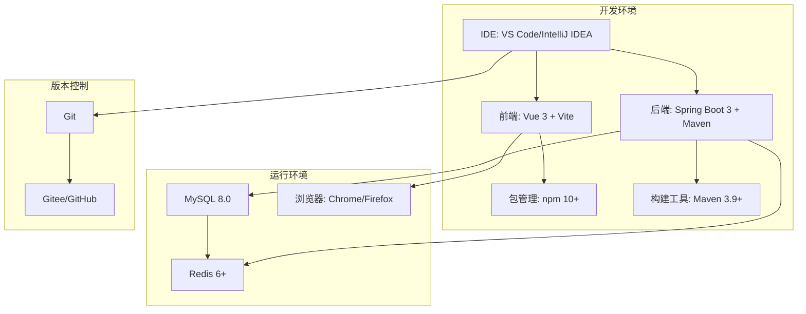

# 植物工厂管理系统开发环境搭建指南

## 📋 目录
- [系统概述](#1-系统概述)
- [环境要求](#2-环境要求)
- [开发工具安装](#3-开发工具安装)
- [数据库环境搭建](#4-数据库环境搭建)
- [后端环境搭建](#5-后端环境搭建)
- [前端环境搭建](#6-前端环境搭建)
- [项目配置](#7-项目配置)
- [开发流程](#8-开发流程)
- [常见问题](#9-常见问题)
- [验证清单](#10-验证清单)

---

## 1. 系统概述

### 1.1 项目技术栈
- **后端技术栈**: Spring Boot 3.1.5 + Java 17 + MySQL 8.0 + Redis
- **前端技术栈**: Vue 3.3.4 + TypeScript + Vite + Ant Design Vue
- **构建工具**: Maven 3.9+ / Node.js 22+
- **容器化**: Docker + Docker Compose

### 1.2 系统架构


---

## 2. 环境要求

### 2.1 硬件要求
| 组件 | 最低配置 | 推荐配置 |
|------|---------|---------|
| CPU | 双核 2.0GHz | 四核 3.0GHz+ |
| 内存 | 8GB | 16GB+ |
| 存储 | 20GB 可用空间 | 50GB+ SSD |
| 网络 | 宽带连接 | 稳定的宽带连接 |

### 2.2 软件环境
基于当前系统信息检测，您的环境如下：

**✅ 当前系统环境**
- **操作系统**: Windows 11 (64位) - 中文版
- **处理器**: AMD64 Family 25 Model 97 (~2501 Mhz)
- **内存**: 16,065 MB (16GB，满足推荐配置)
- **Java版本**: Java 19.0.2 ⚠️ (需要降级到Java 17)
- **Node.js版本**: v22.19.0 ✅
- **npm版本**: 10.9.3 ✅

### 2.3 环境兼容性分析

#### 🎯 关键问题识别
1. **Java版本冲突**: 当前Java 19.0.2 vs 项目要求Java 17
2. **中文Windows环境**: 需要处理编码和路径问题
3. **缺失组件**: Maven、MySQL 8.0、Redis未安装
4. **网络环境**: 国内网络需要优化依赖下载速度

#### 📋 优先级排序
| 优先级 | 任务 | 预计时间 | 风险等级 |
|--------|------|----------|----------|
| 🔴 最高 | Java版本降级 (19→17) | 15-20分钟 | 高 |
| 🟠 高 | 数据库安装配置 (MySQL+Redis) | 20-30分钟 | 中 |
| 🟡 中 | 构建工具安装 (Maven) | 10-15分钟 | 低 |
| 🟢 低 | 中文环境优化配置 | 5-10分钟 | 低 |

---

## 2.4 环境兼容性修复指南

### ⚠️ 重要：Java版本降级 (必须执行)

您当前的Java 19.0.2与Spring Boot 3.1.5不兼容，**必须**降级到Java 17。

#### 详细降级步骤

**步骤1: 完全卸载Java 19**
```cmd
# 1. 通过控制面板卸载
# Win + I → 应用 → 应用和功能 → 搜索"Java" → 卸载所有Java 19相关程序

# 2. 清理环境变量
# 右键"此电脑" → 属性 → 高级系统设置 → 环境变量
# 删除PATH中的Java路径，删除JAVA_HOME变量

# 3. 验证卸载
java -version
# 应显示"命令不存在"或错误信息
```

**步骤2: 安装Java 17 LTS**
```cmd
# 1. 下载Java 17 (推荐Eclipse Temurin)
# 访问: https://adoptium.net/temurin/releases/?version=17
# 选择: Windows x64, JDK, Installer

# 2. 运行安装程序
# 按默认设置安装到: C:\Program Files\Eclipse Adoptium\jdk-17.x.x.x-hotspot

# 3. 配置环境变量
setx JAVA_HOME "C:\Program Files\Eclipse Adoptium\jdk-17.0.x.x-hotspot"
setx PATH "%PATH%;%JAVA_HOME%\bin"

# 4. 立即生效 (重启命令行或重新登录)
refreshenv

# 5. 验证安装
java -version
# 期望输出:
# openjdk version "17.0.x" ...
javac -version
# 期望输出: javac 17.0.x
```

**步骤3: IDE配置更新**
- **IntelliJ IDEA**: File → Project Structure → Project SDK → 选择Java 17
- **VS Code**: 确保Java Extension Pack使用正确的JDK路径

### 🔧 中文Windows环境优化

#### 编码配置优化
```cmd
# 设置系统编码为UTF-8
setx LANG zh_CN.UTF-8
setx LC_ALL zh_CN.UTF-8

# Maven编码设置
setx MAVEN_OPTS "-Dfile.encoding=UTF-8 -Dconsole.encoding=UTF-8"

# Java编码设置
setx JAVA_TOOL_OPTIONS "-Dfile.encoding=UTF-8"
```

#### 路径和文件名处理
```cmd
# 确保支持中文路径
# 在application.yml中添加：
spring:
  servlet:
    multipart:
      max-file-size: 10MB
      max-request-size: 10MB
  http:
    encoding:
      charset: UTF-8
      enabled: true
      force: true
```

---

---

## 3. 开发工具安装 (中国网络环境优化)

### 3.1 快速安装工具 (推荐)

#### 3.1.1 Chocolatey 包管理器安装
```cmd
# 以管理员身份运行 PowerShell
Set-ExecutionPolicy Bypass -Scope Process -Force; [System.Net.ServicePointManager]::SecurityProtocol = [System.Net.ServicePointManager]::SecurityProtocol -bor 3072; iex ((New-Object System.Net.WebClient).DownloadString('https://community.chocolatey.org/install.ps1'))

# 验证安装
choco -version
```

### 3.2 必需软件安装

#### 3.2.1 Java Development Kit (JDK) - 已在2.4节详细说明
**⚠️ 重要**: 请参考[2.4 环境兼容性修复指南](#24-环境兼容性修复指南)进行Java版本降级

#### 3.2.2 Maven 构建工具 (国内优化)
```cmd
# 方法1: 使用 Chocolatey 安装 (推荐)
choco install maven

# 方法2: 手动下载安装
# 下载地址: https://dlcdn.apache.org/maven/maven-3/3.9.6/binaries/apache-maven-3.9.6-bin.zip
# 解压到: C:\Program Files\Apache\maven

# 配置环境变量
setx MAVEN_HOME "C:\Program Files\Apache\maven"
setx PATH "%PATH%;%MAVEN_HOME%\bin"
```

**Maven 镜像源配置 (重要!)**
```xml
<!-- 创建配置文件: C:\Users\%USERNAME%\.m2\settings.xml -->
<?xml version="1.0" encoding="UTF-8"?>
<settings xmlns="http://maven.apache.org/SETTINGS/1.0.0"
          xmlns:xsi="http://www.w3.org/2001/XMLSchema-instance"
          xsi:schemaLocation="http://maven.apache.org/SETTINGS/1.0.0
                              http://maven.apache.org/xsd/settings-1.0.0.xsd">

    <!-- 本地仓库位置 -->
    <localRepository>${user.home}/.m2/repository</localRepository>

    <!-- 阿里云镜像源配置 -->
    <mirrors>
        <mirror>
            <id>aliyunmaven</id>
            <name>阿里云公共仓库</name>
            <url>https://maven.aliyun.com/repository/public</url>
            <mirrorOf>central</mirrorOf>
        </mirror>
        <mirror>
            <id>aliyun-central</id>
            <name>阿里云中央仓库</name>
            <url>https://maven.aliyun.com/repository/central</url>
            <mirrorOf>central</mirrorOf>
        </mirror>
        <mirror>
            <id>aliyun-spring</id>
            <name>阿里云Spring仓库</name>
            <url>https://maven.aliyun.com/repository/spring</url>
            <mirrorOf>spring-libs-milestone</mirrorOf>
        </mirror>
    </mirrors>

    <!-- 代理配置 (如果需要) -->
    <proxies>
        <!-- 如果在公司环境需要代理，取消注释并配置 -->
        <!--
        <proxy>
            <id>my-proxy</id>
            <active>true</active>
            <protocol>http</protocol>
            <host>proxy.company.com</host>
            <port>8080</port>
            <username>proxyuser</username>
            <password>somepassword</password>
            <nonProxyHosts>local.net|some.host.com</nonProxyHosts>
        </proxy>
        -->
    </proxies>
</settings>
```

**验证安装:**
```cmd
mvn -version
# 期望输出: Apache Maven 3.9.x
mvn help:effective-settings
# 验证镜像源配置是否生效
```

#### 3.2.3 Node.js 和 npm (国内优化)
```cmd
# Node.js已安装 v22.19.0 ✅
# 配置npm国内镜像源
npm config set registry https://registry.npmmirror.com
npm config set disturl https://npmmirror.com/dist

# 验证配置
npm config get registry
# 期望输出: https://registry.npmmirror.com

# 配置全局包安装路径 (避免权限问题)
npm config set prefix "C:\Users\%USERNAME%\npm-global"
setx PATH "%PATH%;C:\Users\%USERNAME%\npm-global"

# 安装常用全局工具
npm install -g @vue/cli
npm install -g typescript
npm install -g vite
```

### 3.2 开发IDE

#### 3.2.1 后端开发 (推荐 IntelliJ IDEA)
1. **下载 IntelliJ IDEA Community Edition**
   - 官网: https://www.jetbrains.com/idea/download/
2. **安装必要插件**:
   - Lombok Plugin
   - Spring Boot Plugin
   - Maven Helper Plugin
   - Database Navigator

#### 3.2.2 前端开发 (推荐 VS Code)
1. **下载 Visual Studio Code**
   - 官网: https://code.visualstudio.com/
2. **安装扩展**:
   ```json
   {
     "recommendations": [
       "vue.volar",
       "vue.vscode-typescript-vue-plugin",
       "bradlc.vscode-tailwindcss",
       "esbenp.prettier-vscode",
       "dbaeumer.vscode-eslint",
       "ms-vscode.vscode-json"
     ]
   }
   ```

### 3.3 数据库管理工具

#### 3.3.1 MySQL
```cmd
# 使用 Chocolatey 安装
choco install mysql

# 或下载 MySQL Installer
# 下载地址: https://dev.mysql.com/downloads/installer/
```

#### 3.3.2 Redis
```cmd
# 使用 Chocolatey 安装
choco install redis-64

# 或使用 WSL2 安装
wsl --install
sudo apt-get update
sudo apt-get install redis-server
```

#### 3.3.3 数据库客户端 (推荐 DBeaver)
- 下载地址: https://dbeaver.io/download/
- 支持多种数据库的统一管理界面

---

## 4. 数据库环境搭建

### 4.1 MySQL 安装配置

#### 4.1.1 安装步骤
1. 运行 MySQL Installer
2. 选择 "Server only" 安装类型
3. 配置 MySQL Server:
   - 端口: 3306 (默认)
   - root 密码: 设置强密码 (建议: `root123`)
   - 启用 TCP/IP 网络
   - 设置字符集: `utf8mb4`

#### 4.1.2 创建数据库
```sql
-- 连接 MySQL
mysql -u root -p

-- 创建数据库
CREATE DATABASE plant_factory
CHARACTER SET utf8mb4
COLLATE utf8mb4_unicode_ci;

-- 创建应用用户
CREATE USER 'plant_factory'@'localhost' IDENTIFIED BY 'plant_factory_2024';
GRANT ALL PRIVILEGES ON plant_factory.* TO 'plant_factory'@'localhost';
FLUSH PRIVILEGES;

-- 验证数据库
SHOW DATABASES;
USE plant_factory;
```

### 4.2 Redis 安装配置

#### 4.2.1 Windows 安装
```cmd
# 启动 Redis 服务
redis-server

# 测试连接
redis-cli ping
# 期望输出: PONG
```

#### 4.2.2 配置文件
```ini
# redis.conf 关键配置
port 6379
bind 127.0.0.1
requirepass your_redis_password  # 可选: 设置密码
maxmemory 2gb
maxmemory-policy allkeys-lru
```

---

## 5. 后端环境搭建

### 5.1 Spring Boot 项目创建

#### 5.1.1 使用 Spring Initializr
1. 访问 https://start.spring.io/
2. 配置项目:
   ```
   Project: Maven
   Language: Java
   Spring Boot: 3.1.5
   Group: com.plantfactory
   Artifact: plant-factory-backend
   Name: plant-factory-backend
   Package name: com.plantfactory
   Packaging: Jar
   Java: 17
   ```
3. 添加依赖:
   - Spring Web
   - Spring Data JPA
   - Spring Security
   - MySQL Driver
   - Spring Data Redis
   - Validation

#### 5.1.2 本地项目结构
```
plant-factory-backend/
├── pom.xml
├── src/
│   ├── main/
│   │   ├── java/com/plantfactory/
│   │   │   ├── PlantFactoryApplication.java
│   │   │   ├── config/
│   │   │   ├── controller/
│   │   │   ├── service/
│   │   │   ├── repository/
│   │   │   ├── entity/
│   │   │   └── dto/
│   │   └── resources/
│   │       ├── application.yml
│   │       └── db/migration/
│   └── test/
└── README.md
```

### 5.2 Maven 配置

#### 5.2.1 pom.xml 核心依赖
```xml
<properties>
    <java.version>17</java.version>
    <spring-boot.version>3.1.5</spring-boot.version>
    <mysql.version>8.0.33</mysql.version>
    <lombok.version>1.18.30</lombok.version>
</properties>

<dependencies>
    <!-- Spring Boot Starters -->
    <dependency>
        <groupId>org.springframework.boot</groupId>
        <artifactId>spring-boot-starter-web</artifactId>
    </dependency>
    <dependency>
        <groupId>org.springframework.boot</groupId>
        <artifactId>spring-boot-starter-data-jpa</artifactId>
    </dependency>
    <dependency>
        <groupId>org.springframework.boot</groupId>
        <artifactId>spring-boot-starter-data-redis</artifactId>
    </dependency>
    <dependency>
        <groupId>org.springframework.boot</groupId>
        <artifactId>spring-boot-starter-security</artifactId>
    </dependency>
    <dependency>
        <groupId>org.springframework.boot</groupId>
        <artifactId>spring-boot-starter-validation</artifactId>
    </dependency>

    <!-- Database -->
    <dependency>
        <groupId>mysql</groupId>
        <artifactId>mysql-connector-java</artifactId>
        <version>${mysql.version}</version>
    </dependency>

    <!-- Lombok -->
    <dependency>
        <groupId>org.projectlombok</groupId>
        <artifactId>lombok</artifactId>
        <version>${lombok.version}</version>
        <scope>provided</scope>
    </dependency>
</dependencies>
```

### 5.3 应用配置

#### 5.3.1 application.yml
```yaml
server:
  port: 8080
  servlet:
    context-path: /api

spring:
  application:
    name: plant-factory-management
  profiles:
    active: dev

  # 数据源配置
  datasource:
    url: jdbc:mysql://localhost:3306/plant_factory?useUnicode=true&characterEncoding=utf8&useSSL=false&serverTimezone=Asia/Shanghai
    username: plant_factory
    password: plant_factory_2024
    driver-class-name: com.mysql.cj.jdbc.Driver

  # JPA配置
  jpa:
    hibernate:
      ddl-auto: update  # 开发环境使用 update
    show-sql: true
    properties:
      hibernate:
        dialect: org.hibernate.dialect.MySQL8Dialect
        format_sql: true

  # Redis配置
  data:
    redis:
      host: localhost
      port: 6379
      timeout: 3000ms

# JWT配置
jwt:
  secret: plant-factory-jwt-secret-key-2024
  expiration: 86400000  # 24小时

# 日志配置
logging:
  level:
    com.plantfactory: DEBUG
    org.springframework.security: DEBUG
  pattern:
    console: "%d{yyyy-MM-dd HH:mm:ss} - %msg%n"
    file: "%d{yyyy-MM-dd HH:mm:ss} [%thread] %-5level %logger{36} - %msg%n"
```

---

## 6. 前端环境搭建

### 6.1 Vue 3 项目创建

#### 6.1.1 使用 Vite 创建项目
```cmd
# 创建项目
npm create vue@latest plant-factory-frontend

# 选择配置
✔ Project name: … plant-factory-frontend
✔ Add TypeScript? … Yes
✔ Add JSX Support? … No
✔ Add Vue Router for Single Page Application development? … Yes
✔ Add Pinia for state management? … Yes
✔ Add Vitest for Unit Testing? … Yes
✔ Add an End-to-End Testing Solution? › No
✔ Add ESLint for code quality? … Yes
✔ Add Prettier for code formatting? … Yes

# 进入项目目录
cd plant-factory-frontend

# 安装依赖
npm install
```

#### 6.1.2 安装 Ant Design Vue
```cmd
# 安装 Ant Design Vue
npm install ant-design-vue @ant-design/icons-vue

# 安装图表库
npm install echarts vue-echarts

# 安装日期处理库
npm install dayjs

# 安装 HTTP 客户端
npm install axios

# 安装 Excel 处理库
npm install xlsx
```

### 6.2 项目配置

#### 6.2.1 Vite 配置 (vite.config.ts)
```typescript
import { defineConfig } from 'vite'
import vue from '@vitejs/plugin-vue'
import { resolve } from 'path'

export default defineConfig({
  plugins: [vue()],
  resolve: {
    alias: {
      '@': resolve(__dirname, 'src'),
      '@components': resolve(__dirname, 'src/components'),
      '@views': resolve(__dirname, 'src/views'),
      '@api': resolve(__dirname, 'src/api'),
      '@utils': resolve(__dirname, 'src/utils'),
      '@stores': resolve(__dirname, 'src/stores'),
      '@types': resolve(__dirname, 'src/types')
    }
  },
  server: {
    port: 3000,
    proxy: {
      '/api': {
        target: 'http://localhost:8080',
        changeOrigin: true,
        rewrite: (path) => path.replace(/^\/api/, '')
      }
    }
  },
  build: {
    outDir: 'dist',
    assetsDir: 'assets',
    sourcemap: false
  }
})
```

#### 6.2.2 TypeScript 配置 (tsconfig.json)
```json
{
  "compilerOptions": {
    "target": "ES2020",
    "useDefineForClassFields": true,
    "module": "ESNext",
    "lib": ["ES2020", "DOM", "DOM.Iterable"],
    "skipLibCheck": true,
    "moduleResolution": "bundler",
    "allowImportingTsExtensions": true,
    "resolveJsonModule": true,
    "isolatedModules": true,
    "noEmit": true,
    "jsx": "preserve",
    "strict": true,
    "noUnusedLocals": true,
    "noUnusedParameters": true,
    "noFallthroughCasesInSwitch": true,
    "baseUrl": ".",
    "paths": {
      "@/*": ["src/*"],
      "@components/*": ["src/components/*"],
      "@views/*": ["src/views/*"],
      "@api/*": ["src/api/*"],
      "@utils/*": ["src/utils/*"],
      "@stores/*": ["src/stores/*"],
      "@types/*": ["src/types/*"]
    }
  },
  "include": ["src/**/*.ts", "src/**/*.d.ts", "src/**/*.tsx", "src/**/*.vue"],
  "references": [{ "path": "./tsconfig.node.json" }]
}
```

---

## 7. 项目配置

### 7.1 Git 配置

#### 7.1.1 创建 .gitignore
```
# IDE
.idea/
.vscode/
*.swp
*.swo

# Maven
target/
pom.xml.tag
pom.xml.releaseBackup
pom.xml.versionsBackup
pom.xml.next
release.properties
dependency-reduced-pom.xml
buildNumber.properties
.mvn/timing.properties
.mvn/wrapper/maven-wrapper.jar

# Node.js
node_modules/
npm-debug.log*
yarn-debug.log*
yarn-error.log*
dist/

# Environment
.env
.env.local
.env.development.local
.env.test.local
.env.production.local

# Database
*.db
*.sqlite

# Logs
logs/
*.log

# OS
.DS_Store
Thumbs.db
```

#### 7.1.2 初始化 Git 仓库
```cmd
# 初始化仓库
git init

# 添加远程仓库
git remote add origin https://gitee.com/your-username/plant-factory.git

# 首次提交
git add .
git commit -m "Initial commit: 植物工厂管理系统项目初始化"
git push -u origin master
```

### 7.2 开发环境变量

#### 7.2.1 后端环境变量 (.env)
```env
# 数据库配置
DB_HOST=localhost
DB_PORT=3306
DB_NAME=plant_factory
DB_USERNAME=plant_factory
DB_PASSWORD=plant_factory_2024

# Redis配置
REDIS_HOST=localhost
REDIS_PORT=6379
REDIS_PASSWORD=

# JWT配置
JWT_SECRET=plant-factory-jwt-secret-key-2024
JWT_EXPIRATION=86400000

# 应用配置
SERVER_PORT=8080
CONTEXT_PATH=/api
```

#### 7.2.2 前端环境变量 (.env.development)
```env
# API配置
VITE_API_BASE_URL=http://localhost:8080/api
VITE_APP_TITLE=植物工厂管理系统
VITE_APP_VERSION=1.0.0

# WebSocket配置
VITE_WS_URL=ws://localhost:8080/api/ws
```

---

## 8. 一键安装脚本

### 8.1 环境自动配置脚本

#### 8.1.1 完整环境配置脚本 (setup-dev-env.bat)
```batch
@echo off
echo ==================================================
echo 植物工厂管理系统 - 开发环境一键配置脚本
echo 适用于 Windows 11 中文环境
echo ==================================================
echo.

:: 检查管理员权限
net session >nul 2>&1
if %errorLevel% == 0 (
    echo [✓] 检测到管理员权限
) else (
    echo [✗] 请以管理员身份运行此脚本
    pause
    exit /b 1
)

:: 创建必要的目录
echo [1/7] 创建开发目录结构...
if not exist "C:\dev" mkdir "C:\dev"
if not exist "C:\dev\projects" mkdir "C:\dev\projects"
if not exist "C:\dev\tools" mkdir "C:\dev\tools"

:: 安装 Chocolatey (如果未安装)
echo [2/7] 检查并安装 Chocolatey...
choco -v >nul 2>&1
if %errorLevel% neq 0 (
    echo 正在安装 Chocolatey...
    powershell -NoProfile -InputFormat None -ExecutionPolicy Bypass -Command "Set-ExecutionPolicy Bypass -Scope Process -Force; [System.Net.ServicePointManager]::SecurityProtocol = [System.Net.ServicePointManager]::SecurityProtocol -bor 3072; iex ((New-Object System.Net.WebClient).DownloadString('https://community.chocolatey.org/install.ps1'))"
    refreshenv
) else (
    echo [✓] Chocolatey 已安装
)

:: 安装 Maven
echo [3/7] 安装 Maven...
mvn -v >nul 2>&1
if %errorLevel% neq 0 (
    echo 正在安装 Maven...
    choco install maven -y
    refreshenv
) else (
    echo [✓] Maven 已安装
)

:: 安装 MySQL
echo [4/7] 安装 MySQL 8.0...
mysql --version >nul 2>&1
if %errorLevel% neq 0 (
    echo 正在安装 MySQL...
    choco install mysql --params '/InstallType:Server /Port:3306 /Password:root123' -y
    echo MySQL 安装完成，密码设置为: root123
) else (
    echo [✓] MySQL 已安装
)

:: 安装 Redis
echo [5/7] 安装 Redis...
redis-server --version >nul 2>&1
if %errorLevel% neq 0 (
    echo 正在安装 Redis...
    choco install redis-64 -y
    echo 正在启动 Redis 服务...
    net start redis
) else (
    echo [✓] Redis 已安装
)

:: 配置 npm 镜像源
echo [6/7] 配置 npm 镜像源...
npm config set registry https://registry.npmmirror.com
npm config set disturl https://npmmirror.com/dist

:: 创建 Maven 配置文件
echo [7/7] 创建 Maven 配置...
if not exist "%USERPROFILE%\.m2" mkdir "%USERPROFILE%\.m2"
(
echo ^<?xml version="1.0" encoding="UTF-8"?^>
echo ^<settings xmlns="http://maven.apache.org/SETTINGS/1.0.0"^>
echo     ^<mirrors^>
echo         ^<mirror^>
echo             ^<id^>aliyunmaven^</id^>
echo             ^<name^>阿里云公共仓库^</name^>
echo             ^<url^>https://maven.aliyun.com/repository/public^</url^>
echo             ^<mirrorOf^>central^</mirrorOf^>
echo         ^</mirror^>
echo     ^</mirrors^>
echo ^</settings^>
) > "%USERPROFILE%\.m2\settings.xml"

echo.
echo ==================================================
echo 环境配置完成！
echo ==================================================
echo.
echo 下一步操作：
echo 1. 手动安装 Java 17 (请参考指南中的详细步骤)
echo 2. 安装开发IDE (IntelliJ IDEA + VS Code)
echo 3. 创建并配置项目
echo.
echo 重要提醒：
echo - Java版本需要从19降级到17
echo - MySQL root密码已设置为 root123
echo - Redis服务需要手动启动
echo.
pause
```

#### 8.1.2 Java版本检查脚本 (check-java.bat)
```batch
@echo off
echo ==================================================
echo Java 版本检查和配置工具
echo ==================================================
echo.

:: 检查当前Java版本
echo [1] 检查当前Java版本...
java -version 2>&1 | findstr "version"
echo.

:: 检查JAVA_HOME
echo [2] 检查JAVA_HOME环境变量...
echo 当前JAVA_HOME: %JAVA_HOME%
echo.

:: 检查PATH中的Java路径
echo [3] 检查PATH环境变量...
echo %PATH% | findstr /i "java"
echo.

:: 提供Java 17下载链接
echo [4] Java 17 下载链接：
echo 官方下载: https://adoptium.net/temurin/releases/?version=17
echo 推荐选择: Windows x64, JDK, Installer
echo.

:: 检查是否需要降级
java -version 2>&1 | findstr "19\." >nul
if %errorLevel% == 0 (
    echo [⚠️] 检测到Java 19，需要降级到Java 17！
    echo 请按照以下步骤操作：
    echo 1. 控制面板 → 程序 → 卸载程序
    echo 2. 搜索并卸载所有Java 19相关程序
    echo 3. 下载并安装Java 17
    echo 4. 设置JAVA_HOME环境变量
    echo.
) else (
    java -version 2>&1 | findstr "17\." >nul
    if %errorLevel% == 0 (
        echo [✓] Java版本正确 (17.x.x)
    ) else (
        echo [❓] 未检测到Java或版本不明确
    )
)

pause
```

### 8.2 数据库初始化脚本

#### 8.2.1 MySQL数据库初始化 (init-database.sql)
```sql
-- 植物工厂管理系统数据库初始化脚本
-- 适用于MySQL 8.0+

-- 创建数据库
CREATE DATABASE IF NOT EXISTS plant_factory
CHARACTER SET utf8mb4
COLLATE utf8mb4_unicode_ci;

USE plant_factory;

-- 创建应用用户
CREATE USER IF NOT EXISTS 'plant_factory'@'localhost' IDENTIFIED BY 'plant_factory_2024';
GRANT ALL PRIVILEGES ON plant_factory.* TO 'plant_factory'@'localhost';
FLUSH PRIVILEGES;

-- 创建基础表结构
-- 用户表
CREATE TABLE IF NOT EXISTS users (
    id BIGINT PRIMARY KEY AUTO_INCREMENT COMMENT '用户ID',
    username VARCHAR(50) NOT NULL UNIQUE COMMENT '用户名',
    password VARCHAR(100) NOT NULL COMMENT '密码(加密)',
    email VARCHAR(100) UNIQUE COMMENT '邮箱',
    phone VARCHAR(20) COMMENT '手机号',
    real_name VARCHAR(50) COMMENT '真实姓名',
    status ENUM('ACTIVE', 'INACTIVE', 'LOCKED') DEFAULT 'ACTIVE' COMMENT '用户状态',
    created_at DATETIME DEFAULT CURRENT_TIMESTAMP COMMENT '创建时间',
    updated_at DATETIME DEFAULT CURRENT_TIMESTAMP ON UPDATE CURRENT_TIMESTAMP COMMENT '更新时间',
    deleted_at DATETIME COMMENT '删除时间',

    INDEX idx_username (username),
    INDEX idx_email (email),
    INDEX idx_status (status)
) ENGINE=InnoDB DEFAULT CHARSET=utf8mb4 COLLATE=utf8mb4_unicode_ci COMMENT='用户表';

-- 生产区域表
CREATE TABLE IF NOT EXISTS production_areas (
    id BIGINT PRIMARY KEY AUTO_INCREMENT COMMENT '区域ID',
    area_code VARCHAR(50) NOT NULL UNIQUE COMMENT '区域编码',
    area_name VARCHAR(100) NOT NULL COMMENT '区域名称',
    area_type ENUM('SEEDING', 'GROWING', 'FLOWERING', 'HARVESTING') DEFAULT 'GROWING' COMMENT '区域类型',
    capacity DECIMAL(8,2) NOT NULL COMMENT '容量(平方米)',
    current_usage DECIMAL(8,2) DEFAULT 0 COMMENT '当前使用面积(平方米)',
    location VARCHAR(200) COMMENT '位置描述',
    status ENUM('ACTIVE', 'MAINTENANCE', 'INACTIVE') DEFAULT 'ACTIVE' COMMENT '状态',
    created_at DATETIME DEFAULT CURRENT_TIMESTAMP COMMENT '创建时间',
    updated_at DATETIME DEFAULT CURRENT_TIMESTAMP ON UPDATE CURRENT_TIMESTAMP COMMENT '更新时间',

    INDEX idx_area_code (area_code),
    INDEX idx_area_type (area_type),
    INDEX idx_status (status)
) ENGINE=InnoDB DEFAULT CHARSET=utf8mb4 COLLATE=utf8mb4_unicode_ci COMMENT='生产区域表';

-- 插入初始数据
INSERT IGNORE INTO production_areas (area_code, area_name, area_type, capacity, location) VALUES
('AREA001', 'A区-育苗', 'SEEDING', 50.00, '东侧1层'),
('AREA002', 'B区-生长', 'GROWING', 200.00, '东侧2-3层'),
('AREA003', 'C区-数据管理', 'GROWING', 150.00, '西侧1层'),
('AREA004', 'D区-报表分析', 'GROWING', 100.00, '西侧2层');

-- 创建默认管理员用户 (密码: admin123)
INSERT IGNORE INTO users (username, password, email, real_name, status) VALUES
('admin', '$2a$10$EblZqNptyYvcLm/VwDCVAuBjzZOI7khzdyGPBr08PpIi0na624b8e', 'admin@plantfactory.com', '系统管理员', 'ACTIVE');

-- 显示初始化结果
SELECT '数据库初始化完成' as message;
SELECT COUNT(*) as areas_count FROM production_areas;
SELECT COUNT(*) as users_count FROM users;
```

### 8.3 验证脚本

#### 8.3.1 环境验证脚本 (verify-env.bat)
```batch
@echo off
echo ==================================================
echo 开发环境验证工具
echo ==================================================
echo.

:: 验证Java
echo [1/8] 验证 Java 环境...
java -version 2>&1 | findstr "17\." >nul
if %errorLevel% == 0 (
    echo [✓] Java 17 已正确安装
) else (
    echo [✗] Java 17 未正确安装或版本不符
    java -version
)

:: 验证Maven
echo [2/8] 验证 Maven 环境...
mvn -v >nul 2>&1
if %errorLevel% == 0 (
    echo [✓] Maven 已正确安装
    mvn -v | findstr "Apache Maven"
) else (
    echo [✗] Maven 未正确安装
)

:: 验证Node.js
echo [3/8] 验证 Node.js 环境...
node -v >nul 2>&1
if %errorLevel% == 0 (
    echo [✓] Node.js 已正确安装
    node -v
) else (
    echo [✗] Node.js 未正确安装
)

:: 验证npm
echo [4/8] 验证 npm 环境...
npm -v >nul 2>&1
if %errorLevel% == 0 (
    echo [✓] npm 已正确安装
    npm -v
    echo    镜像源:
    npm config get registry
) else (
    echo [✗] npm 未正确安装
)

:: 验证MySQL
echo [5/8] 验证 MySQL 环境...
sc query mysql80 >nul 2>&1
if %errorLevel% == 0 (
    echo [✓] MySQL 服务已安装
    mysql --version
) else (
    echo [✗] MySQL 服务未安装或未运行
)

:: 验证Redis
echo [6/8] 验证 Redis 环境...
tasklist | findstr "redis-server" >nul
if %errorLevel% == 0 (
    echo [✓] Redis 服务正在运行
) else (
    echo [⚠️] Redis 服务未运行
    echo 尝试启动: net start redis
)

:: 验证网络连接
echo [7/8] 验证网络连接...
ping -n 1 maven.aliyun.com >nul 2>&1
if %errorLevel% == 0 (
    echo [✓] 可以连接阿里云镜像源
) else (
    echo [⚠️] 无法连接阿里云镜像源，可能影响依赖下载
)

:: 验证开发目录
echo [8/8] 验证开发目录...
if exist "C:\dev" (
    echo [✓] 开发目录已创建
) else (
    echo [⚠️] 开发目录未创建，建议手动创建 C:\dev
)

echo.
echo ==================================================
echo 验证完成！请检查上述结果
echo ==================================================
pause
```

### 8.4 快速启动脚本

#### 8.4.1 开发环境启动脚本 (start-dev.bat)
```batch
@echo off
echo ==================================================
echo 植物工厂管理系统 - 开发环境启动脚本
echo ==================================================
echo.

:: 启动MySQL
echo [1/4] 启动 MySQL 服务...
net start mysql80
if %errorLevel% == 0 (
    echo [✓] MySQL 服务启动成功
) else (
    echo [⚠️] MySQL 服务可能已经在运行或启动失败
)

:: 启动Redis
echo [2/4] 启动 Redis 服务...
net start redis
if %errorLevel% == 0 (
    echo [✓] Redis 服务启动成功
) else (
    echo [⚠️] Redis 服务可能已经在运行或启动失败
    echo 尝试手动启动: redis-server
)

:: 检查端口占用
echo [3/4] 检查端口占用情况...
netstat -an | findstr ":8080" >nul
if %errorLevel% == 0 (
    echo [⚠️] 端口8080已被占用
) else (
    echo [✓] 端口8080可用
)

netstat -an | findstr ":3000" >nul
if %errorLevel% == 0 (
    echo [⚠️] 端口3000已被占用
) else (
    echo [✓] 端口3000可用
)

:: 提示下一步操作
echo [4/4] 环境准备完成！
echo.
echo 下一步操作：
echo 1. 启动后端服务: cd plant-factory-backend ^&^& mvn spring-boot:run
echo 2. 启动前端服务: cd plant-factory-frontend ^&^& npm run dev
echo 3. 访问应用: http://localhost:3000
echo.
pause
```

---

## 9. 开发流程

### 8.1 日常开发流程

#### 8.1.1 启动开发环境
```cmd
# 启动数据库服务
net start mysql
redis-server

# 启动后端服务
cd plant-factory-backend
mvn spring-boot:run

# 启动前端服务 (新终端)
cd plant-factory-frontend
npm run dev
```

#### 8.1.2 开发分支管理
```cmd
# 创建功能分支
git checkout -b feature/environment-monitor

# 提交代码
git add .
git commit -m "feat: 添加环境监控功能"

# 推送到远程
git push origin feature/environment-monitor

# 合并到主分支
git checkout main
git merge feature/environment-monitor
```

### 8.2 构建和测试

#### 8.2.1 后端构建测试
```cmd
# 编译项目
mvn clean compile

# 运行测试
mvn test

# 打包项目
mvn clean package -DskipTests

# 运行应用
java -jar target/plant-factory-backend-1.0.0.jar
```

#### 8.2.2 前端构建测试
```cmd
# 类型检查
npm run type-check

# 代码检查
npm run lint

# 代码格式化
npm run format

# 运行测试
npm run test

# 构建生产版本
npm run build

# 预览构建结果
npm run preview
```

---

## 10. 故障排除指南 (Windows 11 中文环境)

### 10.1 🔥 关键问题：Java版本冲突

#### 10.1.1 Java 19 降级到 Java 17 完整解决方案
**症状**: Spring Boot 3.1.5 启动失败，提示版本不兼容
**根本原因**: Java 19 与 Spring Boot 3.1.5 存在兼容性问题

**完整解决步骤**:
```cmd
# 1. 彻底卸载Java 19
# 方法1: 通过控制面板
# Win + I → 应用 → 应用和功能 → 搜索"Java" → 卸载所有Java 19

# 方法2: 通过命令行
wmic product where "name like 'Java %%19%%'" call uninstall

# 2. 清理注册表和环境变量
# 删除 JAVA_HOME 环境变量
setx JAVA_HOME ""
# 从PATH中删除Java路径

# 3. 清理残留文件
rmdir /s /q "C:\Program Files\Java" 2>nul
rmdir /s /q "C:\Program Files (x86)\Java" 2>nul

# 4. 下载并安装Java 17 LTS
# 访问: https://adoptium.net/temurin/releases/?version=17
# 选择: Windows x64, JDK, Installer
# 默认安装到: C:\Program Files\Eclipse Adoptium\jdk-17.0.x.x-hotspot

# 5. 重新配置环境变量
setx JAVA_HOME "C:\Program Files\Eclipse Adoptium\jdk-17.0.x.x-hotspot"
setx PATH "%PATH%;%JAVA_HOME%\bin"

# 6. 验证安装
java -version
# 期望输出: openjdk version "17.0.x"
```

#### 10.1.2 多版本Java共存处理
**场景**: 需要同时保留Java 19和Java 17
**解决方案**: 使用版本管理工具
```cmd
# 使用SDKMAN (Windows适配版)
# 下载地址: https://sdkman.io/install

# 或者手动配置多版本切换脚本
# 创建 java-switch.bat 文件
@echo off
echo 当前Java版本:
java -version
echo.
echo 选择要切换的Java版本:
echo 1. Java 17
echo 2. Java 19
set /p choice=请输入选择:

if %choice%==1 (
    setx JAVA_HOME "C:\Program Files\Eclipse Adoptium\jdk-17.0.x.x-hotspot"
    echo 已切换到Java 17
)
if %choice%==2 (
    setx JAVA_HOME "C:\Program Files\Eclipse Adoptium\jdk-19.x.x.x-hotspot"
    echo 已切换到Java 19
)
echo 请重新打开命令行以生效
pause
```

### 10.2 🌐 网络和依赖下载问题

#### 10.2.1 Maven依赖下载失败或缓慢
**问题**: Maven依赖下载缓慢或失败
**解决方案**:
```xml
<!-- 在 %USERPROFILE%\.m2\settings.xml 中配置 -->
<settings>
    <mirrors>
        <!-- 阿里云公共仓库 -->
        <mirror>
            <id>aliyunmaven</id>
            <name>阿里云公共仓库</name>
            <url>https://maven.aliyun.com/repository/public</url>
            <mirrorOf>central</mirrorOf>
        </mirror>
        <!-- 华为云镜像 (备用) -->
        <mirror>
            <id>huaweicloud</id>
            <name>华为云镜像</name>
            <url>https://repo.huaweicloud.com/repository/maven/</url>
            <mirrorOf>central</mirrorOf>
        </mirror>
    </mirrors>
</settings>
```

**命令行验证**:
```cmd
# 清理本地仓库并重新下载
mvn dependency:purge-local-repository

# 强制更新依赖
mvn clean install -U

# 检查镜像配置是否生效
mvn help:effective-settings
```

#### 10.2.2 npm依赖安装问题
**问题**: npm install失败或缓慢
**解决方案**:
```cmd
# 1. 配置多个镜像源
npm config set registry https://registry.npmmirror.com
npm config set disturl https://npmmirror.com/dist

# 设置备用镜像源
npm config set registry https://registry.npm.taobao.org

# 2. 清理缓存
npm cache clean --force

# 3. 删除问题文件
rmdir /s /q node_modules 2>nul
del package-lock.json 2>nul

# 4. 重新安装
npm install

# 5. 验证配置
npm config get registry
npm config list
```

### 10.3 🇨🇳 中文Windows环境特有问题

#### 10.3.1 编码问题导致的错误
**症状**:
- 控制台输出乱码
- 文件名包含中文时出错
- 数据库插入中文数据失败

**解决方案**:
```cmd
# 1. 设置系统编码
setx LANG zh_CN.UTF-8
setx LC_ALL zh_CN.UTF-8

# 2. Maven编译编码
setx MAVEN_OPTS "-Dfile.encoding=UTF-8 -Dconsole.encoding=UTF-8"

# 3. Java启动参数
setx JAVA_TOOL_OPTIONS "-Dfile.encoding=UTF-8 -Dconsole.encoding=UTF-8"
```

**IDE配置**:
- **IntelliJ IDEA**: File → Settings → Editor → File Encodings → 全部设置为UTF-8
- **VS Code**: 设置 → 搜索"encoding" → 配置files.encoding为utf8

#### 10.3.2 路径包含中文的问题
**问题**: 项目路径包含中文导致编译失败
**解决方案**:
```cmd
# 1. 创建纯英文路径的项目目录
mkdir C:\dev\plant-factory

# 2. 移动项目到英文路径
# 如果原路径包含中文，建议重新在英文路径创建项目

# 3. 在application.yml中配置文件上传
spring:
  servlet:
    multipart:
      max-file-size: 10MB
      max-request-size: 10MB
      location: C:\dev\uploads
```

### 10.4 🗄️ 数据库连接问题

#### 10.4.1 MySQL连接失败
**常见错误**:
- "Communications link failure"
- "Access denied for user"
- "Unknown database 'plant_factory'"

**解决方案**:
```sql
-- 1. 检查MySQL服务状态
-- Win + R → services.msc → 查找MySQL服务

-- 2. 重置root密码 (如果忘记)
ALTER USER 'root'@'localhost' IDENTIFIED BY 'root123';
FLUSH PRIVILEGES;

-- 3. 重新创建数据库和用户
DROP DATABASE IF EXISTS plant_factory;
CREATE DATABASE plant_factory CHARACTER SET utf8mb4 COLLATE utf8mb4_unicode_ci;

DROP USER IF EXISTS 'plant_factory'@'localhost';
CREATE USER 'plant_factory'@'localhost' IDENTIFIED BY 'plant_factory_2024';
GRANT ALL PRIVILEGES ON plant_factory.* TO 'plant_factory'@'localhost';
FLUSH PRIVILEGES;

-- 4. 测试连接
mysql -u plant_factory -p plant_factory
# 输入密码: plant_factory_2024
```

**Windows防火墙配置**:
```cmd
# 允许MySQL端口通过防火墙
netsh advfirewall firewall add rule name="MySQL" dir=in action=allow protocol=TCP localport=3306
```

#### 10.4.2 Redis连接问题
**问题**: Redis服务无法启动或连接失败
**解决方案**:
```cmd
# 1. 检查Redis服务状态
sc query redis

# 2. 手动启动Redis
redis-server

# 3. 检查端口占用
netstat -ano | findstr :6379

# 4. 配置Redis服务自启动
sc config redis start= auto
net start redis

# 5. 测试连接
redis-cli ping
# 期望输出: PONG
```

### 10.5 🔧 开发工具问题

#### 10.5.1 IntelliJ IDEA配置问题
**问题**:
- 无法识别Maven项目
- JDK版本配置错误
- 编码设置问题

**解决方案**:
```
1. 配置JDK:
   File → Project Structure → Project SDK → 选择Java 17
   File → Project Structure → Platform Settings → SDKs → 添加Java 17

2. 配置Maven:
   File → Settings → Build Tools → Maven
   - Maven home directory: 选择Maven安装目录
   - User settings file: C:\Users\%USERNAME%\.m2\settings.xml

3. 配置编码:
   File → Settings → Editor → File Encodings
   - 全部设置为UTF-8
```

#### 10.5.2 VS Code配置问题
**问题**:
- Vue插件不工作
- TypeScript报错
- 终端编码问题

**解决方案**:
```json
// settings.json
{
    "files.encoding": "utf8",
    "terminal.integrated.env.windows": {
        "LANG": "zh_CN.UTF-8"
    },
    "typescript.preferences.importModuleSpecifier": "relative",
    "vue.codeActions.enabled": true
}
```

### 10.6 🚀 端口冲突问题

#### 10.6.1 端口被占用解决方案
```cmd
# 查看端口占用情况
netstat -ano | findstr :8080  # 后端端口
netstat -ano | findstr :3000  # 前端端口

# 终止占用端口的进程
taskkill /PID <进程ID> /F

# 或者修改项目端口
# 后端: application.yml 中修改 server.port
# 前端: vite.config.ts 中修改 server.port
```

### 10.7 📋 性能优化问题

#### 10.7.1 Maven编译内存不足
**问题**: Maven编译时内存溢出
**解决方案**:
```cmd
# 设置MAVEN_OPTS
setx MAVEN_OPTS "-Xmx2g -Xms512m -XX:MaxMetaspaceSize=1g"

# 或在项目根目录创建.mvn/jvm.config
-Xmx2g
-Xms512m
-XX:MaxMetaspaceSize=1g
```

#### 10.7.2 Node.js内存限制
**问题**: 前端项目构建时内存不足
**解决方案**:
```cmd
# 增加Node.js内存限制
setx NODE_OPTIONS "--max-old-space-size=4096"

# 在package.json中配置
"scripts": {
    "build": "node --max-old-space-size=4096 node_modules/.bin/vite build"
}
```

### 10.8 🆘 紧急救援脚本

#### 10.8.1 环境重置脚本 (reset-env.bat)
```batch
@echo off
echo ==================================================
echo 环境重置脚本 - 仅在遇到严重问题时使用
echo ==================================================
echo.

echo [警告] 此脚本将清理开发环境配置，请确认后继续
pause

:: 重置Java环境变量
setx JAVA_HOME ""
setx MAVEN_HOME ""
setx NODE_OPTIONS ""

:: 清理npm配置
npm config delete registry
npm config delete disturl

:: 重置PATH (谨慎操作)
echo 请手动清理PATH中的Java、Maven相关路径

:: 清理缓存
rmdir /s /q "%USERPROFILE%\.m2\repository" 2>nul
npm cache clean --force

echo 环境重置完成，请重新配置开发环境
pause
```

---

## 11. 验证清单 (基于当前系统环境)

### 11.1 🔴 关键兼容性验证

#### Java 环境验证 (最高优先级)
- [ ] **Java 19 已完全卸载**
- [ ] **Java 17 LTS 已正确安装**
- [ ] **JAVA_HOME 指向 Java 17 目录**
- [ ] **`java -version` 显示 17.x.x (而非19.x.x)**
- [ ] **`javac -version` 显示 17.x.x**
- [ ] **PATH环境变量包含Java 17路径，不包含Java 19**

**验证命令**:
```cmd
java -version
# 应该显示: openjdk version "17.0.x"

javac -version
# 应该显示: javac 17.0.x

echo %JAVA_HOME%
# 应该显示: C:\Program Files\Eclipse Adoptium\jdk-17.0.x.x-hotspot
```

### 11.2 🟠 基础开发环境验证

#### Maven 环境验证
- [ ] Maven 3.9+ 已安装
- [ ] MAVEN_HOME 环境变量已设置
- [ **阿里云镜像源配置已生效**
- [ ] Maven 可以正常下载依赖
- [ ] `mvn -version` 显示正确版本

**验证命令**:
```cmd
mvn -version
mvn help:effective-settings
# 检查是否包含阿里云镜像配置
```

#### Node.js 环境验证 (当前已满足)
- [x] Node.js v22.19.0 已安装 ✅
- [x] npm 10.9.3 已安装 ✅
- [ ] **npm 配置了国内镜像源**
- [ ] **npm 全局包安装路径已设置**
- [ ] npm 可以正常安装包

**验证命令**:
```cmd
node -v
npm -v
npm config get registry
# 应该显示: https://registry.npmmirror.com
```

### 11.3 🟡 数据库环境验证

#### MySQL 8.0 环境验证
- [ ] MySQL 8.0 服务正在运行
- [ ] **plant_factory 数据库已创建**
- [ ] **应用用户 plant_factory 已创建并授权**
- [ ] **字符集设置为 utf8mb4**
- [ ] 可以通过客户端连接数据库
- [ ] Windows防火墙允许3306端口

**验证命令**:
```cmd
mysql --version
sc query mysql80

# 数据库连接测试
mysql -u plant_factory -p plant_factory
# 密码: plant_factory_2024

# 验证数据库和用户
SHOW DATABASES LIKE 'plant_factory';
SELECT User, Host FROM mysql.user WHERE User = 'plant_factory';
```

#### Redis 环境验证
- [ ] Redis 服务正在运行
- [ ] 端口6379未被占用
- [ ] `redis-cli ping` 返回 PONG
- [ ] Redis 配置文件已优化

**验证命令**:
```cmd
redis-server --version
redis-cli ping
netstat -ano | findstr :6379
```

### 11.4 🟢 开发工具验证

#### IDE 配置验证
- [ ] IntelliJ IDEA 已安装并配置Java 17
- [ ] Maven 配置正确 (指向3.9+版本)
- [ ] 文件编码设置为UTF-8
- [ ] VS Code 已安装必要扩展
- [ ] VS Code 终端编码设置正确

#### 项目结构验证
- [ ] 开发目录已创建 (建议: C:\dev\)
- [ ] Git 配置正确
- [ ] 环境变量文件已创建
- [ ] 配置文件编码正确

### 11.5 🔄 网络和依赖验证

#### 网络连接验证
- [ ] **可以访问阿里云Maven镜像源**
- [ ] **可以访问npm镜像源**
- [ ] 网络连接稳定
- [ ] 防火墙配置正确

**验证命令**:
```cmd
ping maven.aliyun.com
ping registry.npmmirror.com
curl -I https://maven.aliyun.com/repository/public/
```

### 11.6 🚀 功能验证

#### 项目创建验证
- [ ] Spring Boot 项目可以正常创建
- [ ] Maven 编译成功
- [ ] Vue 3 项目可以正常创建
- [ ] npm install 成功完成

#### 服务启动验证
- [ ] MySQL 服务可以正常启动
- [ ] Redis 服务可以正常启动
- [ ] Spring Boot 应用可以启动 (Java 17)
- [ ] Vue 开发服务器可以启动
- [ ] 端口8080和3000可用

**验证步骤**:
```cmd
# 1. 启动数据库服务
net start mysql80
redis-server

# 2. 测试后端项目创建
mvn archetype:generate -DgroupId=com.plantfactory -DartifactId=test-backend -DinteractiveMode=false
cd test-backend
mvn clean compile
# 如果编译成功，说明Maven环境正常

# 3. 测试前端项目创建
cd .. \
npm create vue@latest test-frontend
cd test-frontend
npm install
npm run dev
# 如果启动成功，说明前端环境正常
```

### 10.2 项目验证清单

#### ✅ 后端项目
- [ ] 项目可以正常编译
- [ ] 单元测试可以运行
- [ ] Spring Boot 应用可以启动
- [ ] 可以访问 http://localhost:8080/api/actuator/health

#### ✅ 前端项目
- [ ] npm install 成功完成
- [ ] 项目可以正常启动
- [ ] 可以访问 http://localhost:3000
- [ ] 页面可以正常加载
- [ ] API 代理配置正常

### 10.3 开发工具验证
- [ ] IDE 可以正常运行和调试
- [ ] Git 配置正确，可以提交代码
- [ ] 代码格式化工具工作正常
- [ ] 数据库客户端可以连接数据库

---

## 12. 📞 技术支持与资源

### 12.1 快速问题诊断

**遇到问题时，请按以下顺序检查**:
1. **Java版本问题** → 运行 `check-java.bat` 或查看[10.1节](#101-关键问题java版本冲突)
2. **网络连接问题** → 检查[10.2节](#102-网络和依赖下载问题)
3. **编码问题** → 查看[10.3节](#103-中文windows环境特有问题)
4. **数据库连接问题** → 参考[10.4节](#104-数据库连接问题)

### 12.2 官方文档资源

#### 核心技术文档
- **Spring Boot 3**: [https://spring.io/projects/spring-boot](https://spring.io/projects/spring-boot)
- **Java 17**: [https://docs.oracle.com/javase/17/](https://docs.oracle.com/javase/17/)
- **Vue 3**: [https://vuejs.org/](https://vuejs.org/)
- **TypeScript**: [https://www.typescriptlang.org/](https://www.typescriptlang.org/)
- **Ant Design Vue**: [https://antdv.com/](https://antdv.com/)

#### 数据库文档
- **MySQL 8.0**: [https://dev.mysql.com/doc/refman/8.0/en/](https://dev.mysql.com/doc/refman/8.0/en/)
- **Redis**: [https://redis.io/documentation](https://redis.io/documentation)

### 12.3 中文社区资源

#### 技术社区
- **Spring Boot 中文**: [https://springboot.io/](https://springboot.io/)
- **Vue.js 中文**: [https://cn.vuejs.org/](https://cn.vuejs.org/)
- **掘金**: [https://juejin.cn/](https://juejin.cn/)
- **思否**: [https://segmentfault.com/](https://segmentfault.com/)

#### 问答平台
- **Stack Overflow**: [https://stackoverflow.com/](https://stackoverflow.com/)
- **知乎**: [https://www.zhihu.com/](https://www.zhihu.com/)
- **CSDN**: [https://www.csdn.net/](https://www.csdn.net/)

### 12.4 工具下载地址

#### 必需软件下载
| 软件 | 下载地址 | 推荐版本 |
|------|---------|---------|
| Java 17 LTS | [https://adoptium.net/temurin/releases/?version=17](https://adoptium.net/temurin/releases/?version=17) | 17.0.x |
| Maven | [https://maven.apache.org/download.cgi](https://maven.apache.org/download.cgi) | 3.9.x |
| IntelliJ IDEA | [https://www.jetbrains.com/idea/download/](https://www.jetbrains.com/idea/download/) | Community Edition |
| VS Code | [https://code.visualstudio.com/](https://code.visualstudio.com/) | Latest |
| MySQL | [https://dev.mysql.com/downloads/installer/](https://dev.mysql.com/downloads/installer/) | 8.0.x |
| DBeaver | [https://dbeaver.io/download/](https://dbeaver.io/download/) | Latest |

#### 国内镜像下载
- **Maven**: [阿里云镜像](https://dlcdn.apache.org/maven/)
- **Node.js**: [淘宝镜像](https://npmmirror.com/mirrors/node/)
- **MySQL**: [各大高校开源镜像站](https://mirrors.tuna.tsinghua.edu.cn/)

### 12.5 版本兼容性对照表

#### 当前环境状态
| 组件 | 项目要求 | 您的当前版本 | 状态 | 优先级 |
|------|---------|-------------|------|--------|
| Java | **17 (必需)** | **19.0.2** | 🔴 **冲突** | **最高** |
| Maven | 3.9+ | 未安装 | 🟠 需安装 | 高 |
| Node.js | 18+ | **22.19.0** | ✅ **符合** | - |
| npm | 9+ | **10.9.3** | ✅ **符合** | - |
| MySQL | 8.0+ | 未安装 | 🟠 需安装 | 高 |
| Redis | 6.0+ | 未安装 | 🟠 需安装 | 中 |

### 12.6 紧急联系方式

#### 文档反馈
- **问题报告**: 在GitHub仓库提交Issue
- **改进建议**: 发送邮件至开发团队
- **技术讨论**: 加入项目交流群

#### 环境支持
如果您在环境搭建过程中遇到无法解决的问题，可以：
1. 运行 `verify-env.bat` 获取详细环境信息
2. 运行 `check-java.bat` 检查Java版本问题
3. 查看本文档[第10章 故障排除指南](#10-故障排除指南-windows-11-中文环境)
4. 重新运行一键安装脚本 `setup-dev-env.bat`

### 12.7 更新日志

#### v2.1 (2025年11月) - 当前版本
- ✅ 基于Windows 11中文环境全面优化
- ✅ 添加Java 19→17降级详细指南
- ✅ 集成国内镜像源配置
- ✅ 提供一键安装脚本
- ✅ 完善中文编码处理方案
- ✅ 增加紧急救援脚本

#### v2.0 (原版本)
- ✅ 基础环境搭建指南
- ✅ 通用技术栈说明
- ✅ 基本故障排除方案

---

## 🎯 快速开始建议

### 对于您的当前环境，建议按以下顺序执行：

1. **立即执行**: Java版本降级 (19→17) - [参考2.4节](#24-环境兼容性修复指南)
2. **自动化安装**: 运行 `setup-dev-env.bat` 安装其他组件
3. **验证环境**: 运行 `verify-env.bat` 检查安装结果
4. **开始开发**: 使用 `start-dev.bat` 启动开发环境

**预计总时间**: 1-2小时 (主要是Java降级和数据库安装)

---

*文档版本: v2.1 (Windows 11中文环境优化版)*
*最后更新: 2025年11月11日*
*维护团队: 植物工厂管理系统开发组*
*适用环境: Windows 11 中文版 + 16GB内存 + AMD处理器*